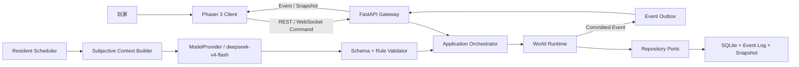
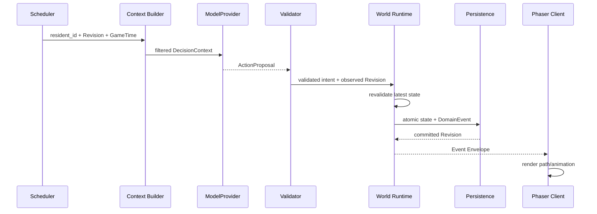

# 总体权威架构

## 1. 目的

定义本地 Client–Server 拓扑、后端权威边界、AI 提案链、前端渲染边界、队列隔离、模块责任和恢复顺序，为所有子系统提供唯一架构基线。

## 2. 非目标

本文件不定义各 Domain 的完整 Schema、公式、画面资源或 REST 路由；这些内容由对应 canonical domain 文档负责。本架构不支持远程服务、多客户端协作或前端离线写入。

## 3. 术语与定义

| 术语 | 定义 |
|---|---|
| Authority Server | 本机 FastAPI 进程，唯一可提交世界状态与 Revision 的进程 |
| Client | Phaser 3 / TypeScript 浏览器应用，只发送 Command 并渲染已提交 Event |
| World Runtime | 串行提交世界变更、推进 GameTime、执行确定性规则的核心 |
| Application Orchestrator | 在 Domain Port 间编排用例、事务与队列，不拥有 Domain 规则 |
| Proposal Pipeline | 从主观上下文到 `ActionProposal`、校验、Reservation、事务和事件的完整链 |
| Read Model | 从已提交状态派生、供 AI 或前端读取的不可变投影 |
| Recovery Barrier | 恢复完成且所有核心不变量通过前，禁止 World Tick 与写命令 |

## 4. 规则与不变量

- `RULE-FOUNDATION-002`：后端是世界状态、Revision、位置、经济、战斗和权限的唯一权威。
- `RULE-FOUNDATION-003`：Client 动画、模型输出、日志文本和缓存均不构成规则事实。
- `RULE-FOUNDATION-004`：Domain 模块不得依赖 Phaser、SQLite SQL 或具体模型 SDK；分别通过 DTO、Repository Port 与 `ModelProvider` Port 交互。
- `RULE-FOUNDATION-005`：AI、长任务、存档写入与 WebSocket 出站队列彼此隔离，任何一个队列不得阻塞 World Tick 提交。
- `RULE-FOUNDATION-006`：状态变更与不可丢弃 `DomainEvent` 在同一 SQLite 事务中提交。
- `RULE-FOUNDATION-007`：所有异步返回结果必须携带决策时 Revision，并在最新状态上重新校验。

## 5. 数据与接口

### 5.1 本地拓扑

### 5.2 后端模块责任

| 模块 | 责任 | 禁止事项 |
|---|---|---|
| `api/` | REST、WebSocket、Session、协议适配 | 直接写 Domain 状态 |
| `bootstrap/` | 配置、依赖装配、启动/关闭 | 承载业务规则 |
| `world/` | Tick、Revision、命令提交、Domain Event | 调用 Phaser 或模型 SDK |
| `residents/` | Resident aggregate 与生命周期 | 拥有物品价格或伤害公式 |
| `ai/` | Context、Prompt、ModelProvider、Proposal 校验 | 直接提交数据库 |
| `memory/`, `social/` | 主观记忆、信念、关系、秘密访问 | 把主观信念写成客观事实 |
| `navigation/` | Walkability、Collision、路径与转场 | 从图片像素推断规则 |
| `economy/` | Currency、Item、Inventory、Transaction | 非事务转移所有权 |
| `magic/`, `combat/` | 注册法术、回合与数值结算 | 让模型给出可信数值结果 |
| `events/` | WorldEvent、Quest、Building、Weather | 允许 Director 任意写状态 |
| `persistence/` | Repository、Event Log、Snapshot、Migration | 向 Domain 泄漏 SQL |
| `security/` | Secret、Session、权限与脱敏策略 | 存储原始 API Key 到 SQLite |
| `diagnostics/` | 结构化日志、指标与诊断包 | 收集未授权秘密或 Chain of Thought |

`DES-FOUNDATION-002`：Application Orchestrator 通过显式 Port 调用各 Domain，并将一次命令的状态、事件、Reservation 结果置于同一 Unit of Work。

### 5.3 队列

| 队列 | 消费者 | 顺序/容量策略 |
|---|---|---|
| World Command Queue | 单一 World Writer | 每世界 FIFO，严格 Revision 命令冲突即拒绝 |
| AI Request Queue | Model workers | 普通居民并发 2；危险、战斗、玩家对话优先 |
| Long Action Queue | Simulation scheduler | 以 GameTime deadline 调度，可取消且幂等完成 |
| Persistence Queue | 单写入连接 | 批量非关键写，但事务事件不与状态分离 |
| WebSocket Outbox | 每 Session sender | Domain Event 不丢；位置 render delta 可合并 |

## 6. 正常流程

### 6.1 AI 行动提交

模型不能指定可信 `actor_id`、`world_id`、Revision、伤害、价格结算或路径；这些字段由服务器补充或计算。

### 6.2 玩家命令

Client 发送带 `command_id` 与 `expected_revision` 的 `PlayerCommand`；Gateway 完成协议、Session 与权限检查；World Runtime 完成 Domain 校验、幂等检查和事务提交；Client 仅在收到 Event 后更新权威投影。

### 6.3 恢复

启动依次完成配置与 Secret 装配、数据库复制保护、Migration、SQLite integrity、Snapshot 读取、Event Log 重放、未完成 Reservation/AI Request 核对、核心不变量检查、Revision 投影重建，最后解除 Recovery Barrier。

## 7. 边界情况

- AI 响应到达时 Revision 已变化：重新校验；可保持的提案继续，否则返回 `REPLAN_REQUIRED`。
- WebSocket 断线：按最后确认 Revision 增量补发；增量不可用或积压过大则发 Snapshot。
- Client 动画中刷新：重建最新权威投影，不依据未完成动画回滚服务器。
- 单个世界写入繁忙：受控排队并暴露 backpressure；不创建第二个写入者。
- 保存请求与交易并发：Snapshot 只能锚定已提交 Revision，不观察半事务状态。

## 8. 错误与降级

ModelProvider 失败进入有限重试和 Utility AI；Persistence 写入失败则事务回滚、保持旧 Revision 并暂停相关写入；Outbox 失败保留不可丢事件并重连；渲染错误只影响表现，不伪造成功或逆向修改世界。

## 9. 安全与性能

服务只绑定 `127.0.0.1`，同源提供前端和 API；WebSocket 使用单次 Ticket。Secret Provider 仅返回短生命周期凭据引用。World Tick 预算独立于模型网络延迟；慢查询、日志和 Snapshot 使用有界批次，且不得在 Tick critical section 执行外部 I/O。

## 10. 验收标准

- 架构测试证明 Client、模型与 Event Director 均无法绕过 World Runtime 提交状态。
- 故障注入证明四类队列互不造成级联阻塞。
- 同一命令重复、过期 Proposal、断线重连与 Snapshot fallback 均保持一致 Revision。
- 进程崩溃恢复后当前状态与 Event Log 在同一提交边界。
- Domain 源码依赖审计不存在 Phaser、具体 SQLite 驱动或 DeepSeek SDK 的越层引用。

## 11. 测试追踪

| 测试 ID | 设计/规则 | 断言 |
|---|---|---|
| `TEST-FOUNDATION-008` | `DES-FOUNDATION-002`, `RULE-FOUNDATION-002..004` | 非权威组件无法提交状态 |
| `TEST-FOUNDATION-009` | `RULE-FOUNDATION-005` | 模型/存档/连接延迟不阻塞 10 Hz Tick |
| `TEST-FOUNDATION-010` | `RULE-FOUNDATION-006` | 状态与事件原子提交、故障回滚 |
| `TEST-FOUNDATION-011` | `RULE-FOUNDATION-007` | 过期 Proposal 在最新 Revision 重校验 |
| `TEST-FOUNDATION-012` | Recovery Barrier | 恢复检查完成前无写命令和 Tick |

## 12. 关联文档

- `DOC-FOUNDATION-003`：Domain 边界与依赖方向
- `DOC-FOUNDATION-005`：权威、事件、Revision 与幂等不变量
- `DOC-FOUNDATION-006`：ID、时间与坐标标准
- `DOC-BACKEND-001..012`：API、协议和本地安全的 canonical 细化
- `DOC-RELEASE-001..012`：持久化、恢复与发布的 canonical 细化
