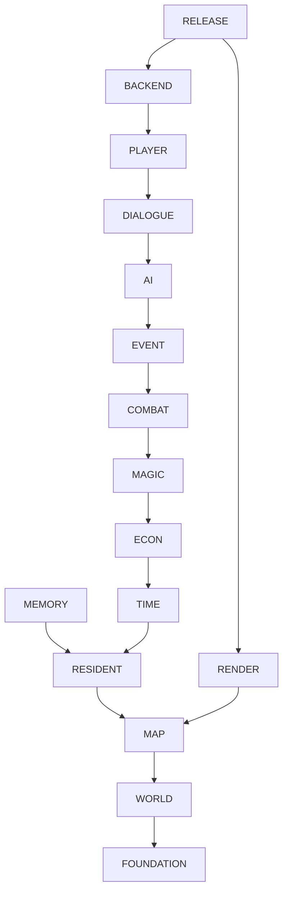

# 系统边界、依赖方向与数据所有权

## 1. 目的

固定十五个 subsystem domain 的职责、允许依赖、禁止依赖和 canonical data ownership，避免规则重复、循环引用与跨域直接写入。

## 2. 非目标

本文件不替代各 domain 内部组件设计，不规定物理目录必须一一对应部署进程；十五个 domain 均运行于本地单体中的逻辑边界。

## 3. 术语与定义

| 术语 | 定义 |
|---|---|
| Canonical Owner | 对一个术语、Schema、规则或状态具有唯一写定义权的 domain |
| Consumer | 通过稳定 ID、Port、Command 或 Event 使用其他 domain 合约的一方 |
| Allowed Dependency | 对 owner 发布的只读类型、Port 或 Event Contract 的依赖 |
| Forbidden Dependency | 直接访问其他 domain Repository、内部 aggregate、SDK 或表现层实现 |
| Domain Event Integration | owner 提交事实，其他 domain 通过事件更新自己的派生状态 |

## 4. 规则与不变量

- `RULE-FOUNDATION-008`：每个全局规则和持久状态字段必须有且仅有一个 Canonical Owner。
- `RULE-FOUNDATION-009`：跨域写入只能通过 owner 的 Command/Port；不得直接写 owner 的表或 aggregate。
- `RULE-FOUNDATION-010`：Domain 层依赖图必须保持有向无环；需要双向业务协作时由 Application Orchestrator 使用 Command/Event 解耦。
- `RULE-FOUNDATION-011`：跨域引用只使用稳定 ID，不复制可变快照作为第二权威。

## 5. 数据与接口

### 5.1 十五个 domain ownership

| 序 | Domain / 前缀 | Canonical ownership | 允许依赖的 provider |
|---:|---|---|---|
| 1 | 世界与游戏设计 `WORLD` | lore、区域身份、种族文化、法律、Canon、内容边界 | `FOUNDATION` |
| 2 | 地图、空间与导航 `MAP` | 坐标投影、区域拓扑、Walkability、Collision、路径、Entrance | `FOUNDATION`, `WORLD` |
| 3 | 渲染、美术与音频 `RENDER` | Phaser Scene、Asset/Animation ID、视觉层、UI token、音频状态 | `FOUNDATION`, `WORLD`, `MAP` |
| 4 | 居民与生命周期 `RESIDENT` | Resident 身份、属性、Needs、健康、职业/住所引用、生命周期 | `FOUNDATION`, `WORLD`, `MAP` |
| 5 | AI 决策与模型编排 `AI` | DecisionContext、Prompt、ActionProposal、模型路由、Utility AI | 业务 domain 的只读 Port/Event |
| 6 | 记忆与社会关系 `MEMORY` | Memory、Belief、关系维度、Rumor、Secret ACL、Commitment | `FOUNDATION`, `WORLD`, `RESIDENT` |
| 7 | 时间、调度与世界模拟 `TIME` | GameTime、倍率、Tick、调度层级、长任务、Seed stream | `FOUNDATION`, `WORLD`, `RESIDENT` |
| 8 | 玩家与镇长模式 `PLAYER` | Player identity、输入 Command、模式与管理权限、Admin audit request | `MAP`, `RESIDENT`, `TIME`, `DIALOGUE`, `ECON`, `MAGIC`, `COMBAT`, `EVENT` |
| 9 | 对话与交流 `DIALOGUE` | Conversation、Speech Act、对话生命周期与内容安全 | `WORLD`, `RESIDENT`, `MEMORY`, `TIME`, `AI` |
| 10 | 经济、职业与物品 `ECON` | Currency、Item、Inventory、Ownership、Transaction、价格、制造 | `FOUNDATION`, `WORLD`, `RESIDENT`, `TIME` |
| 11 | 魔法系统 `MAGIC` | Magic school、Mana、SpellDefinition、施法合法性、注册效果 | `FOUNDATION`, `WORLD`, `MAP`, `RESIDENT`, `ECON` |
| 12 | 回合制战斗与健康 `COMBAT` | Encounter、Turn、战斗 Action、公式、Status、伤害/治疗结果 | `FOUNDATION`, `RESIDENT`, `TIME`, `ECON`, `MAGIC` |
| 13 | 事件、任务、建筑与环境 `EVENT` | WorldEvent、Quest、Weather、Building、WorldDiff、Director Template | `FOUNDATION`, `WORLD`, `MAP`, `RESIDENT`, `TIME`, `ECON`, `MAGIC`, `COMBAT` |
| 14 | 后端、API 与安全 `BACKEND` | REST/WebSocket 协议、Session、Envelope、事务编排、错误码、本地安全 | 全部业务 domain 的公开 Port/Schema |
| 15 | 存档、启动与发布质量 `RELEASE` | SQLite 布局、Migration、Snapshot、存档、Launcher、Package、质量 Gate | `BACKEND`, `RENDER` 及各 domain 的持久化 Port |

Foundation 本身拥有全局 vocabulary、跨系统 invariants、ID/时间/坐标基元、traceability 和文档索引，不计入十五个 subsystem。

### 5.2 无环依赖层

箭头表示 consumer 依赖 provider 的公开合约。图为层级约束的 transitive reduction；第 5.1 节列出允许的直接 provider 集合。

### 5.3 禁止依赖矩阵

| Consumer | 禁止依赖 |
|---|---|
| 任一业务 Domain | Phaser、HTTP Request、SQLite SQL、Windows Credential API、具体 DeepSeek SDK |
| `AI` | 任一 Repository 写接口、未过滤 Secret、可信伤害/价格/路径计算 |
| `RENDER` | Domain Repository、规则状态写入、像素推断 Collision |
| `BACKEND` | 在 route handler 内实现业务公式；绕过 owner Command |
| `RELEASE` | 修改 Domain 规则以迁就存储格式；把 Secret 写进 Snapshot |
| `PLAYER` / `DIALOGUE` | 直接修改关系、Inventory、战斗或 Quest 状态 |
| `EVENT` | 直接写 MAP Polygon；必须提交 Building/WorldDiff 事件并调用 MAP validation Port |

`DES-FOUNDATION-003`：跨域交互统一采用 `Query Port -> immutable DTO`、`Command Port -> Result` 或 `DomainEvent -> subscriber` 三种形式。

## 6. 正常流程

1. Consumer 以稳定实体 ID 查询 owner 的只读 Port。
2. Consumer 构造 owner 定义的 Command，不携带可伪造权威字段。
3. Application Orchestrator 建立 Unit of Work，调用 owner 校验与提交。
4. Owner 生成 DomainEvent；订阅者只更新各自拥有的派生状态。
5. 跨域失败时整个原子用例回滚，Revision 不增长。

## 7. 边界情况

- Building 同时影响 Collision：`EVENT` 拥有 Building 状态，`MAP` 拥有 Collision；Orchestrator 在同一事务中先做 MAP 预验证，再提交两个 owner 的事件。
- Resident Inventory：`RESIDENT` 仅持有 inventory reference，数量、槽位和所有权由 `ECON` 独占。
- Resident HP 与伤害：`RESIDENT` 拥有持久健康状态，`COMBAT` 拥有伤害公式与 Encounter 结果；结果事件由 RESIDENT Port 应用。
- 对话改变关系：`DIALOGUE` 产出结构化 Speech Act，`MEMORY` 根据已提交事件解释并更新关系。
- AI 选择战斗动作：`AI` 选择合法集合中的 ID，`COMBAT` 计算全部数值。

## 8. 错误与降级

跨域 Port 不可用时，命令返回稳定错误码且不部分提交。只读投影落后时携带其 Revision，写入前重新校验。无法确定 owner 的新需求不得实现为共享可写表，应先在本文件登记 ownership。

## 9. 安全与性能

最小数据披露原则适用于 Domain Port：AI 和对话只接收当前 actor 可知字段。批量 Query 应提供按 Revision 缓存的只读 DTO，禁止 N+1 Repository 穿透；Domain Event subscriber 必须幂等并可重放。

## 10. 验收标准

- 十五个 subsystem 均有唯一 prefix、ownership 与允许依赖。
- 自动依赖审计在 Domain 层检测不到环。
- 每个跨域状态变化可定位到 owner Command 与 DomainEvent。
- Inventory、伤害、Collision、关系、Secret、Revision 均无竞争定义。
- 新增跨域 Schema 时可明确落入一个 owner，无法归属即拒绝合并。

## 11. 测试追踪

| 测试 ID | 覆盖规则 | 方法 |
|---|---|---|
| `TEST-FOUNDATION-013` | `RULE-FOUNDATION-008` | canonical registry 唯一性检查 |
| `TEST-FOUNDATION-014` | `RULE-FOUNDATION-009` | Repository/import 静态边界检查 |
| `TEST-FOUNDATION-015` | `RULE-FOUNDATION-010` | Domain graph cycle detection |
| `TEST-FOUNDATION-016` | `RULE-FOUNDATION-011` | 跨域 DTO 与 stable ID contract test |

## 12. 关联文档

- `DOC-FOUNDATION-002`：进程内总体架构和队列
- `DOC-FOUNDATION-004`：共享术语
- `DOC-FOUNDATION-005`：跨系统 invariants
- `DOC-FOUNDATION-008`：十五个 domain 的全部文档路径
