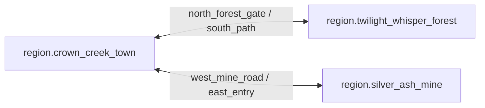

# 区域拓扑

## 1. 目的

`REQ-MAP-002`：把首版三个可玩区域、独立室内和成对 Semantic Exit 固化为有界 Scene graph，提供可加载、可校验、可测试的尺寸与连接关系。

## 2. 非目标

本文不拥有区域 lore、资源分布、建筑清单或视觉风格，也不增加第四个 Overworld 区域。室内 Scene 数量由结构内容注册表决定，不等同于新的主要区域。

## 3. 术语与定义

| 术语 | 定义 |
|---|---|
| Region Scene | 三个主要 Overworld Scene 之一 |
| Interior Scene | 通过 Entrance 进入、拥有独立坐标与 Bounds 的 Scene |
| Paired Exit | 两个方向互相引用、分别拥有 approach 与 arrival 的 Semantic Exit |
| Region Anchor | 用于关键路径审计的必达 Semantic Node |
| Exit Graph | 以 Scene 为顶点、已启用 Paired Exit 为有向边的图 |

## 4. 规则与不变量

- `RULE-MAP-005`：首版 Region Scene 恰好为 `region.crown_creek_town`、`region.twilight_whisper_forest`、`region.silver_ash_mine`，不得通过配置注入第四个主要区域。
- `RULE-MAP-006`：Region Bounds 固定为镇 `4096 × 4096 wu`、森林 `4096 × 4096 wu`、矿洞 `3072 × 3072 wu`；变更必须提升 topology schema version 并重新跑全部关键路径。
- `RULE-MAP-007`：每个跨区域 Exit 必须存在唯一反向 pair、启用状态一致、目标 Scene 匹配，approach 与 arrival 均是合法站立点。
- `RULE-MAP-008`：默认 topology 必须使三个 Region Scene 弱连通；禁用 Exit 可以产生暂时不可达，但不得破坏当前 Scene 内的安全锚点路径。

## 5. 数据与接口

`DES-MAP-002`：默认 topology version `1`：

| Scene ID | Bounds (`wu`) | 必需锚点 |
|---|---:|---|
| `region.crown_creek_town` | `4096 × 4096` | `semantic_anchor.crown_creek.crown_square` |
| `region.twilight_whisper_forest` | `4096 × 4096` | `semantic_anchor.twilight_whisper.oathkeeper_camp` |
| `region.silver_ash_mine` | `3072 × 3072` | `semantic_anchor.silver_ash.entry_shed` |

| Exit ID | Pair ID | Approach `(x,y)` | Arrival `(x,y)` | Facing |
|---|---|---:|---:|---:|
| `semantic_exit.crown_creek.north_forest_gate` | `semantic_exit.twilight_whisper_forest.south_path` | `(2048,160)` | `(2048,128)` | `270°` |
| `semantic_exit.twilight_whisper_forest.south_path` | `semantic_exit.crown_creek.north_forest_gate` | `(2048,3936)` | `(2048,3968)` | `90°` |
| `semantic_exit.crown_creek.west_mine_road` | `semantic_exit.silver_ash_mine.east_entry` | `(160,2048)` | `(128,2048)` | `180°` |
| `semantic_exit.silver_ash_mine.east_entry` | `semantic_exit.crown_creek.west_mine_road` | `(2912,1536)` | `(2944,1536)` | `0°` |



Interior manifest：

```json
{
  "scene_id": "01K1AB2CD3EF4GH5JK6MNP7QRV",
  "scene_template_id": "interior.house.small.floor_0",
  "kind": "interior",
  "width_wu": 1024,
  "height_wu": 768,
  "parent_structure_id": "01K1AB2CD3EF4GH5JK6MNP7QRS",
  "entrance_ids": ["01K1AB2CD3EF4GH5JK6MNP7QRW"],
  "topology_schema_version": 1
}
```

室内宽高必须是 `32 wu` 的整数倍，单边范围为 `512..2048 wu`。

## 6. 正常流程

1. 构建期加载 Region、Interior、Anchor 与 Exit registry。
2. 校验 Stable Catalog ID、Bounds、pair 对称性和 Scene graph。
3. 对每个 approach、arrival、anchor 执行位置合法性检查。
4. 生成不可变 topology snapshot，并交给加载器、Pathfinding 和转场服务。
5. 运行关键路径审计后发布 topology version。

## 7. 边界情况

- Exit 存在反向引用但 pair 指回第三个节点时，整个 registry 失败。
- 室内可有多个 Entrance，但每个 Entrance 都必须有独立 pair 和 arrival。
- 被剧情封锁的 Exit 保留 pair 与坐标，只改变结构化 `enabled` 条件。
- 动态建筑不得覆盖上述四个 Region Exit 的 approach/arrival clearance。
- Scene 名称相似不构成连接，只有 registry edge 构成 topology。

## 8. 错误与降级

拓扑加载失败时不加载相关 Scene；已在其他合法 Scene 的实体保持原位。单个 Interior manifest 错误只隔离该 Interior 及其 Entrance；Region registry 任一错误触发 Recovery Barrier，不生成猜测边。

## 9. 安全与性能

Registry 限制 Region 数为 3、Interior 单边上限为 `2048 wu`、每 Scene Exit 上限为 64。启动时一次构建邻接表，运行时查找为 O(1) ID lookup；不遍历美术资源发现出口。

## 10. 验收标准

- Region registry 恰好三条，Bounds 与总体规格逐值一致。
- 四个默认 Exit 形成两个完整 pair，所有 approach/arrival 合法。
- 默认 Exit Graph 三个 Region 弱连通，无孤立 Region。
- 任一 Interior 均通过显式 Entrance 连接，不能以坐标重叠进入。

## 11. 测试追踪

| 测试 ID | 断言 |
|---|---|
| `TEST-MAP-005` | Region 数量、ID 和尺寸精确匹配基线 |
| `TEST-MAP-006` | Exit pair 双射、Scene 目标、启用状态和坐标合法 |
| `TEST-MAP-007` | 默认 Region graph 弱连通，禁用边后的预期分区可解释 |
| `TEST-MAP-008` | Interior 尺寸、parent、Entrance 和 Bounds contract |

## 12. 关联文档

- `DOC-WORLD-004`：区域叙事身份与地理语义
- `DOC-MAP-001`：Scene 坐标与 Bounds
- `DOC-MAP-008`：门、入口与室内
- `DOC-MAP-009`：跨区域转场
- `DOC-MAP-012`：关键路线 acceptance fixtures
