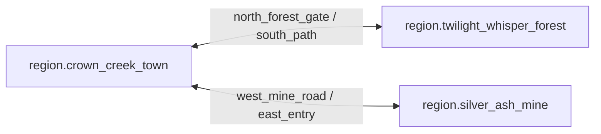

# 区域拓扑

## 1. 目的

`REQ-MAP-002`：把首版三个可玩区域、独立室内和成对 Semantic Exit 固化为有界 Scene graph，提供可加载、可校验、可测试的尺寸与连接关系。

## 2. 非目标

本文不拥有区域 lore、资源分布、建筑清单或视觉风格，也不增加第四个 Overworld 区域。室内 Scene 数量由结构内容注册表决定，不等同于新的主要区域。

## 3. 术语与定义

| 术语 | 定义 |
|---|---|
| Region Scene | 三个主要 Overworld Scene 之一 |
| Interior Scene | 通过 Entrance 进入、拥有独立坐标与 Bounds 的 Scene |
| Paired Exit | 两个方向互相引用、分别拥有 approach 与 arrival 的 Semantic Exit |
| Semantic Node | 可由 ID 解析到 Scene 内具体规则点、profile 约束与可达策略的结构化节点 |
| Region Anchor | `node_type=anchor`、用于关键路径审计的 Required Semantic Node |
| Exit Graph | 以 Scene 为顶点、已启用 Paired Exit 为有向边的图 |
| Availability Evaluation | 在固定 Revision 对注册 condition 求值为 `available/unavailable/evaluation_error` |

## 4. 规则与不变量

- `RULE-MAP-005`：首版 Region Scene 恰好为 `region.crown_creek_town`、`region.twilight_whisper_forest`、`region.silver_ash_mine`，不得通过配置注入第四个主要区域。
- `RULE-MAP-006`：Region Bounds 固定为镇 `4096 × 4096 wu`、森林 `4096 × 4096 wu`、矿洞 `3072 × 3072 wu`；变更必须提升 topology schema version 并重新跑全部关键路径。
- `RULE-MAP-007`：每个跨区域 Exit 必须存在唯一反向 pair；`target_scene_id` 必须等于 pair 的 `scene_id`，`target_arrival_point` 必须逐字段等于 pair 声明的 `arrival_point`，source approach 与两端 arrival 均须合法。
- `RULE-MAP-008`：Required Node 必须 `enabled=true` 且 `availability_condition_id=null`；Conditional Node 必须引用注册 condition，求值 `unavailable` 时为 `not_applicable`，求值 `available` 时必须 enabled 且可达，`evaluation_error` 或 available 但 disabled 均使 Gate 失败。默认 topology 必须使三个 Region Scene 弱连通。

## 5. 数据与接口

`DES-MAP-002`：Semantic layer 以 version `1` 的 canonical manifest 提供可执行节点。下列 JSON 是默认 topology 的唯一权威 registry；后续表格仅由该 JSON 派生，不得反向覆盖 registry。`point` 是 Anchor/交互中心；Exit 额外提供本 Scene 的 `approach_point`、本 Scene 接收反向转场的 `arrival_point`，以及冗余但必须与 pair 校验一致的 `target_arrival_point`：

```json
{
  "semantic_schema_version": 1,
  "nodes": [
    {
      "id": "semantic_anchor.crown_creek.crown_square",
      "kind": "anchor",
      "scene_id": "region.crown_creek_town",
      "point": {"scene_id": "region.crown_creek_town", "x_wu": 2048, "y_wu": 2048},
      "approach_point": null,
      "arrival_point": null,
      "arrival_fallback_points": [],
      "pair_node_id": null,
      "target_scene_id": null,
      "target_arrival_point": null,
      "profile_constraints": {
        "required_tags": ["ground"],
        "max_radius_wu": 16,
        "min_clearance_wu": 2
      },
      "enabled": true,
      "reachability_policy": "required",
      "availability_condition_id": null
    },
    {
      "id": "semantic_anchor.twilight_whisper.oathkeeper_camp",
      "kind": "anchor",
      "scene_id": "region.twilight_whisper_forest",
      "point": {"scene_id": "region.twilight_whisper_forest", "x_wu": 2048, "y_wu": 3584},
      "approach_point": null,
      "arrival_point": null,
      "arrival_fallback_points": [],
      "pair_node_id": null,
      "target_scene_id": null,
      "target_arrival_point": null,
      "profile_constraints": {
        "required_tags": ["ground"],
        "max_radius_wu": 16,
        "min_clearance_wu": 2
      },
      "enabled": true,
      "reachability_policy": "required",
      "availability_condition_id": null
    },
    {
      "id": "semantic_anchor.silver_ash.entry_shed",
      "kind": "anchor",
      "scene_id": "region.silver_ash_mine",
      "point": {"scene_id": "region.silver_ash_mine", "x_wu": 2688, "y_wu": 1536},
      "approach_point": null,
      "arrival_point": null,
      "arrival_fallback_points": [],
      "pair_node_id": null,
      "target_scene_id": null,
      "target_arrival_point": null,
      "profile_constraints": {
        "required_tags": ["ground"],
        "max_radius_wu": 16,
        "min_clearance_wu": 2
      },
      "enabled": true,
      "reachability_policy": "required",
      "availability_condition_id": null
    },
    {
      "id": "semantic_exit.crown_creek.north_forest_gate",
      "kind": "exit",
      "scene_id": "region.crown_creek_town",
      "point": {"scene_id": "region.crown_creek_town", "x_wu": 2048, "y_wu": 96},
      "approach_point": {"scene_id": "region.crown_creek_town", "x_wu": 2048, "y_wu": 160},
      "arrival_point": {"scene_id": "region.crown_creek_town", "x_wu": 2048, "y_wu": 128},
      "arrival_fallback_points": [],
      "pair_node_id": "semantic_exit.twilight_whisper_forest.south_path",
      "target_scene_id": "region.twilight_whisper_forest",
      "target_arrival_point": {"scene_id": "region.twilight_whisper_forest", "x_wu": 2048, "y_wu": 3968},
      "profile_constraints": {
        "required_tags": ["ground"],
        "max_radius_wu": 16,
        "min_clearance_wu": 2
      },
      "enabled": true,
      "reachability_policy": "required",
      "availability_condition_id": null
    },
    {
      "id": "semantic_exit.twilight_whisper_forest.south_path",
      "kind": "exit",
      "scene_id": "region.twilight_whisper_forest",
      "point": {"scene_id": "region.twilight_whisper_forest", "x_wu": 2048, "y_wu": 4000},
      "approach_point": {"scene_id": "region.twilight_whisper_forest", "x_wu": 2048, "y_wu": 3936},
      "arrival_point": {"scene_id": "region.twilight_whisper_forest", "x_wu": 2048, "y_wu": 3968},
      "arrival_fallback_points": [],
      "pair_node_id": "semantic_exit.crown_creek.north_forest_gate",
      "target_scene_id": "region.crown_creek_town",
      "target_arrival_point": {"scene_id": "region.crown_creek_town", "x_wu": 2048, "y_wu": 128},
      "profile_constraints": {
        "required_tags": ["ground"],
        "max_radius_wu": 16,
        "min_clearance_wu": 2
      },
      "enabled": true,
      "reachability_policy": "required",
      "availability_condition_id": null
    },
    {
      "id": "semantic_exit.crown_creek.west_mine_road",
      "kind": "exit",
      "scene_id": "region.crown_creek_town",
      "point": {"scene_id": "region.crown_creek_town", "x_wu": 96, "y_wu": 2048},
      "approach_point": {"scene_id": "region.crown_creek_town", "x_wu": 160, "y_wu": 2048},
      "arrival_point": {"scene_id": "region.crown_creek_town", "x_wu": 128, "y_wu": 2048},
      "arrival_fallback_points": [],
      "pair_node_id": "semantic_exit.silver_ash_mine.east_entry",
      "target_scene_id": "region.silver_ash_mine",
      "target_arrival_point": {"scene_id": "region.silver_ash_mine", "x_wu": 2944, "y_wu": 1536},
      "profile_constraints": {
        "required_tags": ["ground"],
        "max_radius_wu": 16,
        "min_clearance_wu": 2
      },
      "enabled": true,
      "reachability_policy": "required",
      "availability_condition_id": null
    },
    {
      "id": "semantic_exit.silver_ash_mine.east_entry",
      "kind": "exit",
      "scene_id": "region.silver_ash_mine",
      "point": {"scene_id": "region.silver_ash_mine", "x_wu": 3008, "y_wu": 1536},
      "approach_point": {"scene_id": "region.silver_ash_mine", "x_wu": 2912, "y_wu": 1536},
      "arrival_point": {"scene_id": "region.silver_ash_mine", "x_wu": 2944, "y_wu": 1536},
      "arrival_fallback_points": [],
      "pair_node_id": "semantic_exit.crown_creek.west_mine_road",
      "target_scene_id": "region.crown_creek_town",
      "target_arrival_point": {"scene_id": "region.crown_creek_town", "x_wu": 128, "y_wu": 2048},
      "profile_constraints": {
        "required_tags": ["ground"],
        "max_radius_wu": 16,
        "min_clearance_wu": 2
      },
      "enabled": true,
      "reachability_policy": "required",
      "availability_condition_id": null
    }
  ]
}
```

每条 record 必须且只能包含以上 14 个字段（decoder 采用 `additionalProperties=false`）。严格 decoder 以 `kind` 分支：

- `kind=anchor`：`point` 与 `profile_constraints` 非 null；`approach_point`、`arrival_point`、`pair_node_id`、`target_scene_id`、`target_arrival_point` 必须为 null，`arrival_fallback_points` 必须为空数组。
- `kind=exit`：`point`、`approach_point`、`arrival_point`、`pair_node_id`、`target_scene_id`、`target_arrival_point` 与 `profile_constraints` 均非 null；`arrival_fallback_points` 是有序 WorldPoint 数组，默认四条 Exit 均为空。
- 任意非 null WorldPoint 的 `scene_id` 必须匹配字段所属 frame：`point/approach_point/arrival_point` 匹配 record `scene_id`，`target_arrival_point` 匹配 `target_scene_id`。

`reachability_policy` 只允许 `required/conditional`。Condition registry 只接受 Stable Catalog ID，并通过纯函数 `evaluate_availability(condition_id, revision) -> available | unavailable | evaluation_error` 求值；不得嵌入自由文本表达式或读取图片。

以下均为 canonical registry 的 derived human view。默认 topology version `1` 的三个 Anchor 均使用 `profile_constraints={required_tags:[ground],max_radius_wu:16,min_clearance_wu:2}`、`enabled=true`、`reachability_policy=required`、`availability_condition_id=null`，坐标如下：

| Scene ID | Bounds (`wu`) | Required Anchor | `point (x,y)` |
|---|---:|---|---:|
| `region.crown_creek_town` | `4096 × 4096` | `semantic_anchor.crown_creek.crown_square` | `(2048,2048)` |
| `region.twilight_whisper_forest` | `4096 × 4096` | `semantic_anchor.twilight_whisper.oathkeeper_camp` | `(2048,3584)` |
| `region.silver_ash_mine` | `3072 × 3072` | `semantic_anchor.silver_ash.entry_shed` | `(2688,1536)` |

四条默认 Exit 的其他字段均为 `profile_constraints={required_tags:[ground],max_radius_wu:16,min_clearance_wu:2}`、`enabled=true`、`reachability_policy=required`、`availability_condition_id=null`：

| Exit ID | Source Scene | Target Scene / Pair | `point` | Source `approach` | Local `arrival` | Target `arrival` | Facing |
|---|---|---|---:|---:|---:|---:|---:|
| `semantic_exit.crown_creek.north_forest_gate` | `region.crown_creek_town` | `region.twilight_whisper_forest` / `semantic_exit.twilight_whisper_forest.south_path` | `(2048,96)` | `(2048,160)` | `(2048,128)` | `(2048,3968)` | `270°` |
| `semantic_exit.twilight_whisper_forest.south_path` | `region.twilight_whisper_forest` | `region.crown_creek_town` / `semantic_exit.crown_creek.north_forest_gate` | `(2048,4000)` | `(2048,3936)` | `(2048,3968)` | `(2048,128)` | `90°` |
| `semantic_exit.crown_creek.west_mine_road` | `region.crown_creek_town` | `region.silver_ash_mine` / `semantic_exit.silver_ash_mine.east_entry` | `(96,2048)` | `(160,2048)` | `(128,2048)` | `(2944,1536)` | `180°` |
| `semantic_exit.silver_ash_mine.east_entry` | `region.silver_ash_mine` | `region.crown_creek_town` / `semantic_exit.crown_creek.west_mine_road` | `(3008,1536)` | `(2912,1536)` | `(2944,1536)` | `(128,2048)` | `0°` |

对任意 source Exit `s` 与 `t=registry_by_id[s.pair_node_id]`，pair consistency 必须断言：

```text
s.target_scene_id == t.scene_id
s.target_arrival_point == t.arrival_point
t.target_scene_id == s.scene_id
t.target_arrival_point == s.arrival_point
```



Interior manifest：

```json
{
  "scene_id": "01K1AB2CD3EF4GH5JK6MNP7QRV",
  "scene_template_id": "interior.house.small.floor_0",
  "kind": "interior",
  "width_wu": 1024,
  "height_wu": 768,
  "parent_structure_id": "01K1AB2CD3EF4GH5JK6MNP7QRS",
  "entrance_ids": ["01K1AB2CD3EF4GH5JK6MNP7QRW"],
  "topology_schema_version": 1
}
```

室内宽高必须是 `32 wu` 的整数倍，单边范围为 `512..2048 wu`。

## 6. 正常流程

1. 构建期加载 Region、Interior、Anchor 与 Exit registry。
2. 校验 Stable Catalog ID、SemanticNode schema、profile constraints、pair consistency 和 Scene graph。
3. 在固定 Revision 评估 condition，并对 applicable Node 的 point/approach/arrival 执行位置合法性检查。
4. Required Node 与 available Conditional Node 解析为具体 Pathfinding endpoint；unavailable Conditional Node 记录 `not_applicable`。
5. 生成不可变 topology snapshot，并交给加载器、Pathfinding 和转场服务。
6. 运行关键路径审计后发布 topology version。

## 7. 边界情况

- Exit 存在反向引用但 pair 指回第三个节点时，整个 registry 失败。
- Exit 的 `target_arrival_point` 与 pair 的 `arrival_point` 不同，即使两点都合法也必须拒绝。
- 室内可有多个 Entrance，但每个 Entrance 都必须有独立 pair 和 arrival。
- Conditional Node 的 condition 为 unavailable 时不调用 Pathfinding；condition evaluator 出错不得降级为 unavailable。
- 动态建筑不得覆盖上述四个 Region Exit 的 approach/arrival clearance。
- Scene 名称相似不构成连接，只有 registry edge 构成 topology。

## 8. 错误与降级

拓扑加载失败时不加载相关 Scene；已在其他合法 Scene 的实体保持原位。未知 condition、condition evaluation error、pair arrival 不一致或 Node 坐标不可解析均返回显式 validation error。单个 Interior manifest 错误只隔离该 Interior 及其 Entrance；Region registry 任一错误触发 Recovery Barrier，不生成猜测边。

## 9. 安全与性能

Registry 限制 Region 数为 3、Interior 单边上限为 `2048 wu`、每 Scene Semantic Node 上限为 4096、Exit 上限为 64。启动时一次构建 `semantic_node_id -> typed node` 与邻接表，运行时查找为 O(1)；condition evaluator 只读固定 Revision，不遍历美术资源发现节点。

## 10. 验收标准

- Region registry 恰好三条，Bounds 与总体规格逐值一致。
- Anchor/Exit 均可由 typed SemanticNode 解析到具体 Scene point、profile constraints 与 reachability policy。
- 四个默认 Exit 形成两个完整 pair，四个方向的 target arrival 逐字段等于 target Exit 声明的 local arrival。
- 默认 Exit Graph 三个 Region 弱连通，无孤立 Region。
- unavailable Conditional Node 结果为 `not_applicable`；enabled Required Node 能产生 concrete PathResult。
- 任一 Interior 均通过显式 Entrance 连接，不能以坐标重叠进入。

## 11. 测试追踪

| 测试 ID | 断言 |
|---|---|
| `TEST-MAP-005` | Region、typed SemanticNode、Anchor 坐标与 availability evaluation |
| `TEST-MAP-006` | 四方向 Exit pair、Source/Target Scene、source approach 与 target declared arrival 精确一致 |
| `TEST-MAP-007` | 默认 Region graph 弱连通，Required/Conditional reachability 结果可执行 |
| `TEST-MAP-008` | Interior 尺寸、parent、Entrance 和 Bounds contract |

## 12. 关联文档

- `DOC-WORLD-004`：区域叙事身份与地理语义
- `DOC-MAP-001`：Scene 坐标与 Bounds
- `DOC-MAP-008`：门、入口与室内
- `DOC-MAP-009`：跨区域转场
- `DOC-MAP-012`：关键路线 acceptance fixtures
