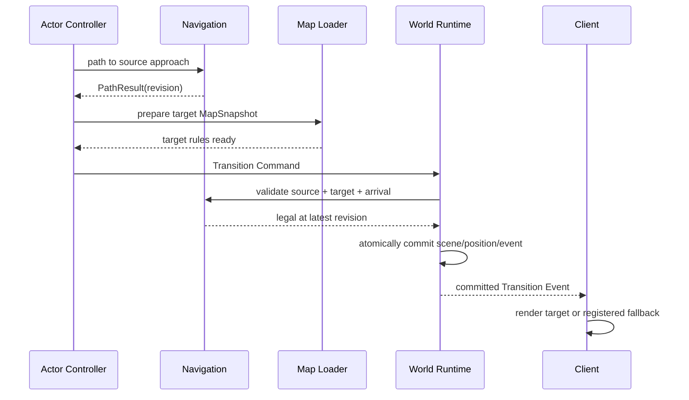

# 区域转场

## 1. 目的

`REQ-MAP-009`：定义通过成对 Region Semantic Exit 的路径、目标加载、验证、原子位置提交与失败恢复，确保转场不是坐标平移或客户端动画副作用。

## 2. 非目标

本文不定义 Scene 视觉淡入淡出、区域 lore、旅行叙事耗时或跨区域 Background simulation；只拥有 Active actor 的空间转移。

## 3. 术语与定义

| 术语 | 定义 |
|---|---|
| Source Exit | actor 当前 Scene 中发起转场的 Semantic Exit |
| Target Exit | Source Exit 唯一 pair 指向的 Exit |
| Transition Command | 携带 actor、source_exit、expected revision 和 command ID 的非权威请求 |
| Arrival Search | 默认 arrival 被动态占用时的有界确定性候选搜索 |
| Transition Event | 同一事务提交后的 Scene/position 变化事实 |
| Render Readiness | 客户端目标 Scene 资源已可表现，不构成转场授权 |

## 4. 规则与不变量

- `RULE-MAP-033`：Region Transition 只能沿 `DOC-MAP-002` 已启用的 Paired Exit；禁止自由提供 target scene/coordinate。
- `RULE-MAP-034`：actor 必须位于 source approach 的 `24 wu` 内、facing 偏差不超过 `45°`，且到 Exit threshold 的 Swept Disc 无阻挡。
- `RULE-MAP-035`：提交前必须在同一最新 Revision 验证 source enabled、permission、目标 MapSnapshot 和 arrival 合法；提交原子改变 `scene_id + position + facing` 并产生一个 Transition Event。
- `RULE-MAP-036`：失败、超时、目标加载错误或 stale revision 均保持 source 位置；客户端不得先行写入目标位置。

## 5. 数据与接口

`DES-MAP-009`：

```json
{
  "command_id": "01K1AB2CD3EF4GH5JK6MNP7QRS",
  "actor_id": "01K1AB2CD3EF4GH5JK6MNP7QRT",
  "source_exit_id": "semantic_exit.crown_creek.north_forest_gate",
  "expected_revision": 118
}
```

成功结果：

```json
{
  "status": "committed",
  "event_id": "01K1AB2CD3EF4GH5JK6MNP7QRV",
  "revision": 119,
  "from": {
    "scene_id": "region.crown_creek_town",
    "exit_id": "semantic_exit.crown_creek.north_forest_gate"
  },
  "to": {
    "scene_id": "region.twilight_whisper_forest",
    "exit_id": "semantic_exit.twilight_whisper_forest.south_path",
    "x_wu": 2048,
    "y_wu": 3968,
    "facing_degrees": 90
  }
}
```

Status enum：

```text
committed | source_exit_disabled | too_far | facing_mismatch |
path_blocked | permission_denied | target_scene_not_ready |
arrival_blocked | stale_revision | idempotent_replay
```

Arrival Search 在目标 arrival 所在 cell 外按 Chebyshev ring `1..8`（最大 `128 wu`）搜索；候选必须与 target exit 同一 Walkable connected component、通过站立/Collision 检查且不落入其他 Semantic trigger。排序为 ring、欧氏距离平方、`cy`、`cx`。若无候选则 `arrival_blocked`。

接口：

```text
prepare_region_transition(actor_id, source_exit_id) -> TransitionPreparation
commit_region_transition(command) -> TransitionResult
recover_transition(command_id) -> committed_result | not_committed
```

## 6. 正常流程



## 7. 边界情况

- 客户端 Ground Art 未 ready 但目标规则层 ready 时可提交；客户端显示登记 fallback，不能影响位置事实。
- 两个 actor 同时抵达同一 arrival 时，Revision 较先提交者占位，后者执行 Arrival Search 或失败。
- Source Exit 在准备后被封锁时，最新 revision 校验失败。
- 崩溃发生在响应前时，以 `(world_id, command_id)` 查询原提交结果，禁止重复转场。
- actor 已在目标 Scene 重放同一 command 时返回 `idempotent_replay`。

## 8. 错误与降级

目标规则层加载失败时保留 source Scene，并按 RealTime `250/500/1000 ms` 最多重试三次后向 actor 返回可解释失败；不沿图片边缘或相邻 Scene ID 猜测出口。客户端断连不回滚已提交转场，重连从 Snapshot/事件恢复。

## 9. 安全与性能

服务器从 registry 解析 target，不信任客户端 target payload。目标规则层可在 actor 距 approach `256 wu` 时预热；同时预热最多 2 个 Scene。Arrival Search 最多检查 8 rings、289 个 cell，超限失败。

## 10. 验收标准

- 两组默认 Region Exit 均支持双向转场且 pair 不串线。
- disabled、blocked、permission、stale、目标加载失败均无 source 位置副作用。
- arrival 冲突按确定顺序选择同 connected component 的 fallback 或明确失败。
- 刷新、断连和重复 command 最多提交一次 Transition Event。
- 玩家与 NPC 使用相同 Transition Command validation。

## 11. 测试追踪

| 测试 ID | 断言 |
|---|---|
| `TEST-MAP-033` | 两组 Paired Exit 双向成功路径 |
| `TEST-MAP-034` | source/permission/revision/target failure 无副作用 |
| `TEST-MAP-035` | Arrival Search 有界、确定且不跨 connected component |
| `TEST-MAP-036` | crash/reconnect/idempotency 与玩家/NPC parity |

## 12. 关联文档

- `DOC-MAP-002`：默认 Exit Graph
- `DOC-MAP-007`：approach path 与 connected component
- `DOC-MAP-008`：室内 transfer 的共享占位原则
- `DOC-MAP-011`：规则层与视觉层加载
- `DOC-MAP-012`：区域转场验收
