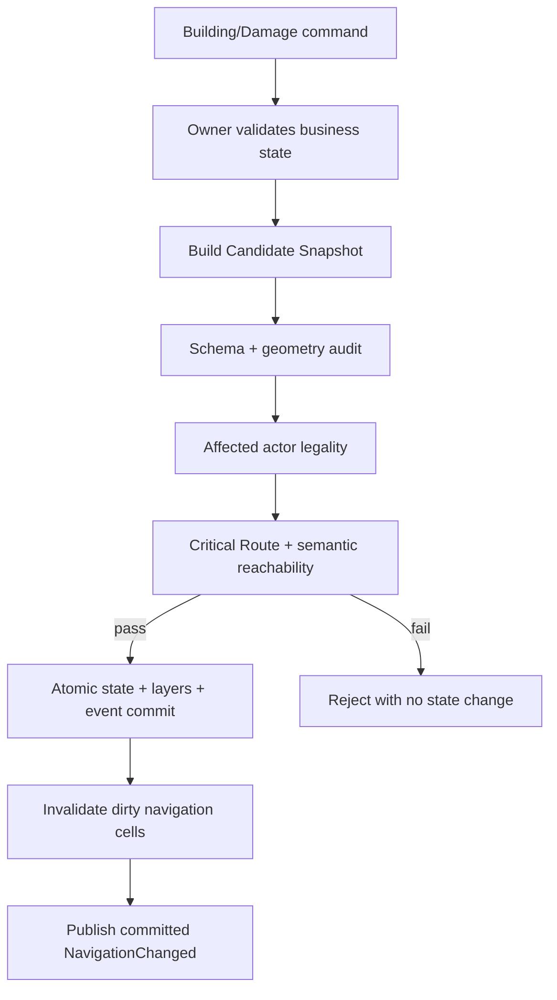

# 动态障碍与导航更新

## 1. 目的

`REQ-MAP-010`：定义建造、施工阶段、损坏、修复、废墟、Door 与环境封锁如何通过 `NavigationPatch` 原子更新 Structure geometry、Walkability、Collision、Semantic 和导航缓存。

## 2. 非目标

本文不拥有 Building 状态机、资源消耗、天气规则或 WorldDiff 历史；MAP 只验证 owner 已批准状态对应的空间 patch，并保证位置/关键路径不变量。

## 3. 术语与定义

| 术语 | 定义 |
|---|---|
| NavigationPatch | 对一个 Scene 规则层的有界 add/replace/remove 变更集 |
| Candidate Snapshot | 尚未提交、用于完整验证的 copy-on-write MapSnapshot |
| Dirty Bounds | Patch shape 与最大受影响 Agent Profile 扩张后的 AABB |
| Critical Route Gate | 提交前对必须保持可达的 route set 执行的检查 |
| Persistent Obstacle | 随 World Revision 提交的门、建筑、废墟、灾害 geometry |
| Occupancy Overlay | actor 短时占位；不改静态 Polygon，用于局部避让和 arrival occupancy |

## 4. 规则与不变量

- `RULE-MAP-037`：Persistent Obstacle 的业务状态、geometry、Collision、Navigation Modifier、Semantic 变化和 DomainEvent 必须在同一 World transaction 提交。
- `RULE-MAP-038`：Patch 必须携带 `expected_revision` 和幂等 command ID；stale/重复请求不得重复应用或基于旧 geometry 覆盖新状态。
- `RULE-MAP-039`：Candidate Snapshot 只有在 Schema、Polygon、位置合法性、Exit/Entrance clearance、不可达节点和 Critical Route Gate 全部通过后才能替换当前 snapshot。
- `RULE-MAP-040`：已在 Dirty Bounds 内的 actor 必须在提交前仍合法；否则命令拒绝，只有明确的灾害/恢复流程可原子携带登记 safe relocation。

## 5. 数据与接口

`DES-MAP-010`：

```json
{
  "command_id": "01K1AB2CD3EF4GH5JK6MNP7QRS",
  "scene_id": "region.crown_creek_town",
  "expected_revision": 210,
  "source_entity_id": "01K1AB2CD3EF4GH5JK6MNP7QRT",
  "source_state": "construction",
  "operations": [
    {
      "op": "replace",
      "layer": "collision",
      "object_id": "01K1AB2CD3EF4GH5JK6MNP7QRZ",
      "object_template_id": "collision.building.construction_stage",
      "value": {
        "shape_type": "polygon",
        "outer_ring_wu": [[800,800],[960,800],[960,928],[800,928]],
        "obstacle_tag": "construction.blocked"
      }
    }
  ],
  "declared_dirty_bounds_wu": [788,788,972,940]
}
```

允许的 `op` 为 `add/replace/remove`；允许层为 `structure/walkability/collision/semantic`。Patch 不含 Ground Art 像素。

接口：

```text
build_candidate(snapshot, patch) -> CandidateSnapshot | PatchError
audit_candidate(candidate, affected_actor_ids, critical_route_set) -> PatchAudit
commit_navigation_patch(command, candidate) -> NavigationPatchResult
subscribe_navigation_changed(scene_id) -> {revision, dirty_cell_ranges, changed_ids}
```

Dirty cell 计算使用真实 geometry bounds 与所有已注册 ground profile 中最大 `radius+clearance` 扩张值；调用方声明 bounds 只能更大，不能缩小计算范围。

Occupancy Overlay 以 actor 已提交位置构建，每 World Tick 刷新；它不改变 Walkability/Collision manifest，不产生永久不可达结论，并通过稳定 actor ID 优先级解决局部让行。

## 6. 正常流程



## 7. 边界情况

- `foundation/construction/intact/lightly_damaged/severely_damaged/ruins` 每次状态变化都提交完整目标 geometry，不依赖客户端增量猜测。
- Patch 删除 Collision 但保留悬空 Semantic Node 时 audit 失败。
- 两个并发 Building patch 修改相交 Dirty Bounds 时，后提交者因 stale revision 重建 candidate。
- Door 高频开关只重建相交 cells；事件顺序仍以 Revision 为准。
- actor 占位不会让 Critical Route Gate 永久失败；Gate 使用静态规则层，另行验证 arrival/safe point 的可排队能力。
- safe relocation 必须位于同 Scene 登记 `recovery_safe_point`，按 actor ID 稳定排序，不能凭最近像素选择。

## 8. 错误与降级

返回 `stale_revision`、`invalid_geometry`、`dirty_bounds_underdeclared`、`actor_trapped`、`critical_route_cut`、`semantic_node_unreachable` 或 `patch_budget_exceeded`。任一错误回滚业务状态与全部层，不发布 NavigationChanged。

## 9. 安全与性能

单 Patch 最多 256 operations、Dirty cells 最多 16384、Candidate audit 默认 100000 A* expanded nodes/route。超过预算拒绝并要求 owner 拆分非原子装饰变化；一个业务状态不可拆分的 geometry 仍必须作为单事务提高离线预检后再提交。

## 10. 验收标准

- 六种 Building/Damage 状态 fixture 的 geometry 与导航同 Revision 可见。
- 任一失败注入均使业务状态、layer hash、Revision 和事件数保持不变。
- Patch 不能困住 actor、覆盖 Exit clearance 或切断 must-remain-open route。
- Door/施工/废墟更新只使相交 dirty cells 失效。
- 重放相同 command ID 只返回原结果，不产生第二次 patch。

## 11. 测试追踪

| 测试 ID | 断言 |
|---|---|
| `TEST-MAP-037` | 六种建筑/损坏状态的原子 geometry 导航更新 |
| `TEST-MAP-038` | stale、幂等、并发相交 patch 与 rollback |
| `TEST-MAP-039` | actor、Exit、Semantic 和 Critical Route Gate |
| `TEST-MAP-040` | Dirty Bounds 扩张、局部 cache invalidation、通知 revision |

## 12. 关联文档

- `DOC-FOUNDATION-005`：位置与原子事件不变量
- `DOC-MAP-004`：五层 Map Package
- `DOC-MAP-007`：NavigationSnapshot
- `DOC-MAP-008`：Door state 与 Reservation
- `DOC-MAP-012`：动态障碍与关键路径验收
