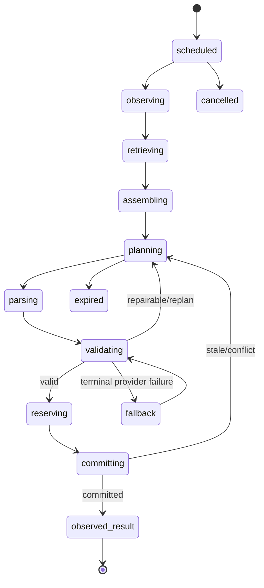

# 居民认知与行动提案流水线

## 1. 目的

`REQ-AI-001`：定义从调度机会、主观观察、记忆检索、三层计划、模型调用、提案校验到 Domain 提交的唯一流水线；保证 AI 只提出意图，不能直接修改世界。

## 2. 非目标

本文不拥有 Resident、Memory、Map、Economy 或 Combat 状态，不计算路径、价格、伤害、产出或权限，也不把模型文本、前端动画或未提交 Proposal 视为事实。

## 3. 术语与阶段

| 阶段 | 输入 | 输出 |
|---|---|---|
| `scheduled` | `SchedulerJob` | 不可变 `DecisionReference` |
| `observing` | actor + Revision | ACL 过滤的 owner projections |
| `retrieving` | goal/routine signals | 可披露 Memory/Belief references |
| `assembling` | projections | `DecisionContextV1` |
| `planning` | context + plan kind | Daily/Hourly/Immediate model request |
| `parsing` | provider response | strict decoded artifact |
| `validating` | Proposal + latest state | validation outcome |
| `reserving` | validated intent | TIME/Domain Reservations |
| `committing` | intent + reservations | atomic state + DomainEvents |
| `observed_result` | committed events | result memory signal + next schedule |

## 4. 数据与接口

`DES-AI-001`：每次认知运行使用 immutable envelope：

```json
{
  "cognition_run_id": "01K1AB2CD3EF4GH5JK6MNP7QRS",
  "resident_id": "01K1AB2CD3EF4GH5JK6MNP7QRT",
  "plan_kind": "immediate_action",
  "observed_revision": 84,
  "observed_game_time": 1830,
  "context_hash": "sha256:8de5c7a8d5f0",
  "prompt_id": "resident-action/v1",
  "request_policy_version": 1,
  "attempt": 1
}
```

状态机：



Ports：

```text
build_decision_context(resident_id, decision_reference) -> DecisionContextV1
request_plan(context, plan_kind, request_policy) -> ModelArtifact
validate_proposal(proposal, decision_reference, latest_revision) -> ValidationOutcome
submit_validated_intent(intent, command_id) -> CommitResult
record_cognition_outcome(run_id, outcome_summary) -> void
```

## 5. 规则与不变量

- `RULE-AI-001`：`DecisionContext` 必须锚定一个 `observed_revision/observed_game_time/context_hash`，构建后不可变。
- `RULE-AI-002`：模型只产生 Daily Plan、Hourly Intent 或 `ActionProposal`；不得调用 Repository、Domain writer、MAP path commit 或 Client。
- `RULE-AI-003`：只有 Domain validator 在最新 Revision 授权参数并由 World Runtime 成功提交后，行动才成立。
- `RULE-AI-004`：渲染和记忆结果只消费 committed DomainEvents；`approved`、网络成功或动画完成都不等于 committed。
- `RULE-AI-005`：同一 `cognition_run_id + artifact_kind + attempt` 只接受一个 provider result；过期/取消结果可审计但不可重新入提交链。
- `RULE-AI-006`：外部 I/O 不在 World Tick critical section 内；任何 provider 延迟不得阻塞权威时钟。

## 6. 正常流程

TIME lease 一个 job；Context Builder 获取 revision-stamped projections 并执行隐私过滤；Prompt Composer 选择版本；`ModelProvider` 返回 JSON；strict decoder 与 AI validation 先检查形状，再由 action owner 校验权限、目标、资源、距离、冷却和规则；TIME 获取必要 Reservation；World Runtime 在最新 Revision 重校验并原子提交；Event Outbox 和结果记忆随后消费 committed events。

## 7. 边界情况

- actor 在请求期间昏迷、进入 Encounter 或切换 Scene：取消或 `REPLAN_REQUIRED`，绝不按旧上下文提交。
- Proposal 合法但目标已离开：owner 可返回 retryable conflict；不得静默换目标。
- Pause 时 RealTime timeout 继续，GameTime 不推进；返回结果只能排队等待恢复校验。
- 同一 actor 同时有 Daily 与 emergency action：emergency 可抢占调度优先级，但不得强抢已持有 Reservation。

## 8. 错误、重试与降级

解析/格式错误最多一次受限 repair；网络瞬态错误按 DOC-AI-009 retry budget；语义 stale 走 replan；权限越界为 forbidden 且不回显秘密；达到 deadline、空响应或 terminal provider failure 进入 DOC-AI-011 Utility AI。任何失败都不得增长 Revision。

## 9. 安全与性能

日志只保存 request metadata、hash、token/latency 和脱敏 outcome，不保存 API Key、完整 Prompt、`reasoning_content` 或未授权秘密。Context 大小、并发、deadline 和每 actor 频率分别受 DOC-AI-008/009 限制。

## 10. 验收标准

- 能从 SchedulerJob 追踪到 Proposal、validation、command 与 committed events。
- provider、validator、World Runtime 和 renderer 的权限边界可由 dependency test 验证。
- stale、cancel、duplicate、timeout 与 crash injection 均无未授权状态变化。
- 模型不可用时 World Tick 与基础生存仍运行。

## 11. 测试追踪

| 测试 ID | 断言 |
|---|---|
| `TEST-AI-001` | 全阶段状态机合法边可达、非法边拒绝 |
| `TEST-AI-002` | AI/Client/render 无世界写入依赖 |
| `TEST-AI-003` | stale/cancel/duplicate result 无副作用 |
| `TEST-AI-004` | 只有 committed event 驱动渲染和结果记忆 |

## 12. 关联文档

- `DOC-AI-002..003`：Context 与 Prompt
- `DOC-AI-004..005`：Proposal 与 Action
- `DOC-AI-009..011`：调度、验证和 fallback
- `DOC-FOUNDATION-002`：权威提交链
