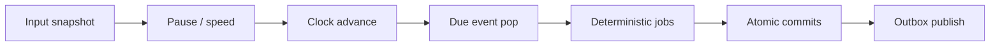

# 世界模拟 Tick

## 1. 目的

`REQ-TIME-003`：定义 10 Hz World Tick 的固定阶段、与 60 FPS render 的隔离、确定顺序、catch-up 上限和故障边界。Tick 是权威提交机会，不要求所有业务逐 Tick 扫描。

## 2. 非目标

本文不拥有前端 game loop、Domain 公式、AI 网络请求或 SQLite 实现；它规定 Orchestrator 何时调用对应 Port 以及哪些操作不得进入 Tick critical section。

## 3. 术语与定义

| 术语 | 定义 |
|---|---|
| Tick Sequence | 每次 World Tick 严格递增的 uint64 |
| Tick Deadline | monotonic RealTime 上的下一次 100 ms 目标时刻 |
| Critical Section | 从读取已提交输入到提交本 Tick 写集的有界确定性阶段 |
| Catch-up Tick | 进程短暂停顿后补做的固定步长 Tick |
| Due Window | `(previous_game_time, current_game_time]` 的事件到期区间 |
| Render Frame | Phaser 约 60 FPS 表现循环，只消费 committed state |

## 4. 规则与不变量

- `RULE-TIME-013`：World Tick 目标 cadence 为 10 Hz、固定步长 100 ms RealTime；Render 目标 60 FPS，二者不得互相计数或等待。
- `RULE-TIME-014`：每 Tick 阶段顺序固定为 `ingest committed inputs → resolve pause/speed → advance clock → pop due events → run deterministic jobs → commit → publish`。
- `RULE-TIME-015`：模型调用、文件 I/O、Snapshot、日志刷盘和 WebSocket 发送不得在 Tick critical section 内 await。
- `RULE-TIME-016`：单次 loop 最多连续执行 5 个 catch-up ticks；仍落后时记录 overload 并由 `DOC-TIME-011` 降档，不能用可变 delta 合并规则计算。
- `RULE-TIME-017`：同一 Tick 的命令按 `(priority_class, accepted_sequence, command_id)` 稳定排序；到期事件按 `DOC-TIME-008` 的全序排序。
- `RULE-TIME-018`：Tick 任一事务失败时该事务 Revision 不增长；其他未开始 job 保留队列，不把未提交结果发布给 Client。

## 5. 数据与接口

`DES-TIME-003`：

```json
{
  "schema_version": 1,
  "world_id": "01K1AB2CD3EF4GH5JK6MNP7QRS",
  "tick_sequence": 40821,
  "started_monotonic_ms": 9812450,
  "previous_game_time": 1830,
  "current_game_time": 1831,
  "clock_phase_quanta": 0,
  "due_event_count": 4,
  "committed_transaction_count": 3,
  "elapsed_real_ms": 18,
  "over_budget": false
}
```

接口：

```text
run_world_tick(tick_sequence, monotonic_now_ms) -> TickResult
enqueue_world_input(CommittedInput) -> AcceptedSequence
get_tick_metrics(window_real_ms) -> TickMetrics
request_quiescence(reason) -> QuiescenceBarrier
```

TickResult 只记录 ID、计数和脱敏 reason code；不含 Secret 或对话正文。

## 6. 正常流程



Render 可在两个 committed position snapshot 间做视觉插值；若后端未推进，render 仍可播放纯表现 idle，但不能产生位置、GameTime 或完成事件。

## 7. 边界情况

- OS 挂起 3 秒后恢复：最多补 5 Tick，然后进入 overload；禁止直接推进 3 游戏分钟。
- 一次 4× Tick 跨多个 GameInstant 分钟时，Event Queue 逐个弹出 Due Window 内事件并保持全序。
- tick 开始后收到命令：分配 accepted sequence，最早下一个 Tick 处理。
- Pause 中仍运行输入接收、AI response 入队、shutdown 和 health jobs；clock/event game deadlines 不推进。
- 某个业务 job 超预算时中止其剩余 batch 并保留 continuation cursor，不改变已提交事务。

## 8. 错误与降级

tick sequence 回退、重复但 payload 不同、clock phase 非法或 event queue 无序时触发 `TIME_TICK_INVARIANT_FAILED` 并申请 fatal pause。单一业务 handler 抛错返回 owner reason code、回滚其事务并隔离；重复错误达到阈值后暂停相关 owner 写入。

## 9. 安全与性能

Tick critical section 的 p95/p99 预算由 `DOC-TIME-011` 规定。每阶段使用有界 batch；输入 payload 在入队前已完成 Schema 与权限检查。metrics 不记录模型 prompt、Secret 或 API Key。

## 10. 验收标准

- 10 Hz 固定步长在相同输入序列下产生相同 Revision/Event 序列。
- 30/60/144 FPS 三种 render cadence 不改变权威 Hash。
- OS stall、业务超时和模型延迟均不产生可变 delta 或 Tick 阻塞。
- Pause Tick 不推进 GameTime，但可处理 shutdown 与已完成异步响应的入队。
- 任一失败事务不发布未提交事件。

## 11. 测试追踪

| 测试 ID | 断言 |
|---|---|
| `TEST-TIME-007` | `RULE-TIME-013..015` cadence、阶段与 I/O 隔离 |
| `TEST-TIME-008` | `RULE-TIME-016..017` catch-up 与稳定顺序 |
| `TEST-TIME-009` | `RULE-TIME-018` transaction failure 原子性 |

## 12. 关联文档

- `DOC-FOUNDATION-002`：队列隔离与 World Runtime
- `DOC-TIME-001`：Clock quanta
- `DOC-TIME-008`：到期事件全序
- `DOC-TIME-011`：Tick budget 与 overload
- `DOC-RENDER-001`：Phaser render 消费边界
