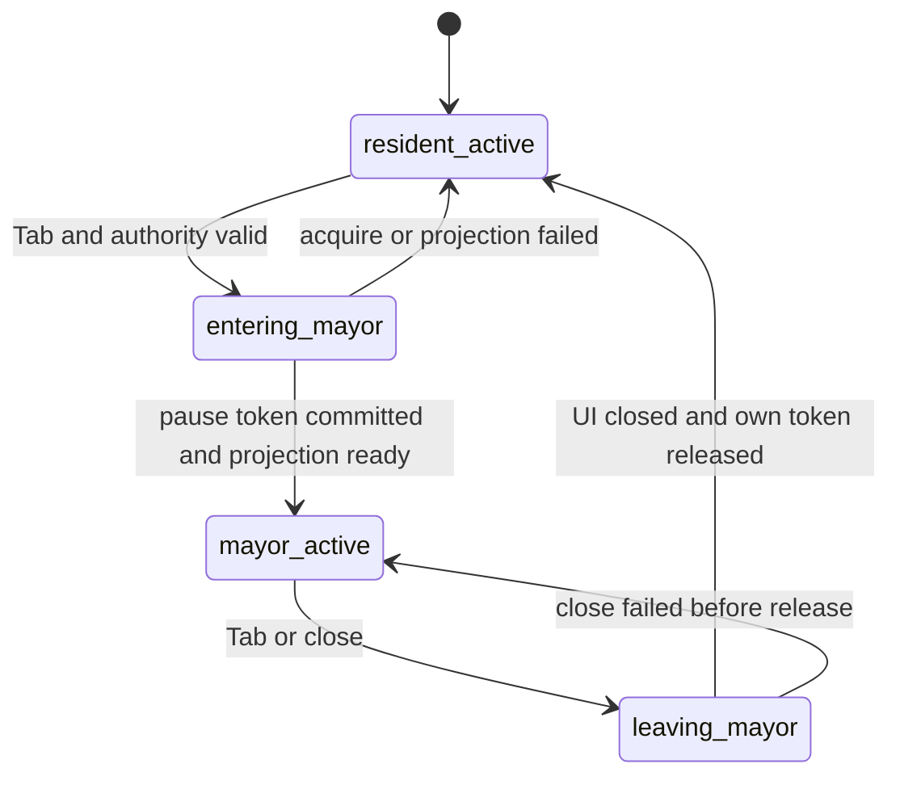

# 居民与镇长模式切换状态机

## 1. 目的

`REQ-PLAYER-003`：定义 `Tab` 触发的居民/镇长模式转换、禁止转换状态、Pause Token 组合与失败恢复，确保模式 UI 不能充当权限提升或世界暂停旁路。

## 2. 非目标

本文不定义 Mayor 具体治理能力、TIME 内部 Clock 算法、DOM 视觉样式或 Encounter 状态机；只拥有玩家 mode aggregate 与转换编排。

## 3. 术语与定义

| 术语 | 定义 |
|---|---|
| Resident Mode | 玩家控制绑定 Resident，世界输入可用 |
| Mayor Mode | 玩家操作受授权治理界面，Overworld 默认暂停 |
| Mode Aggregate | PLAYER 拥有的每 binding 模式与转换版本 |
| Prohibited Transition | 因 authority、Encounter、incapacitation、Recovery 或 modal context 被拒绝的转换 |
| Mayor Pause Token | owner=`player`, reason=`mayor_management` 的 TIME blocking token |

## 4. 规则与不变量

- `RULE-PLAYER-011`：模式只允许 `resident_active → entering_mayor → mayor_active → leaving_mayor → resident_active`；任何 error 必须回到已确认稳定态。
- `RULE-PLAYER-012`：进入 Mayor 前必须在最新 Revision 验证 active binding 和 Mayor office/role；显示 Mayor UI 或 world ownership 不能替代授权。
- `RULE-PLAYER-013`：`mayor_active` 必须持有有效 Mayor Pause Token；离开时只释放自己持有的 token，不能解除 Dialogue、Combat、Shutdown 或其他 owner 的 token。
- `RULE-PLAYER-014`：Encounter active、Resident 昏迷/被俘、Recovery Barrier、存档切换、Admin confirmation 进行中或权限撤销不一致时禁止进入 Mayor。
- `RULE-PLAYER-015`：DOM 输入焦点内的 `Tab` 用于无障碍 focus navigation；仅 world input context 的未修饰 `Tab` 请求模式切换。

## 5. 数据与接口

`DES-PLAYER-003`：

```json
{
  "schema_version": 1,
  "binding_id": "01K1BNDG000000000000000001",
  "mode": "mayor_active",
  "mode_version": 8,
  "mayor_authority_version": 3,
  "pause_token_id": "01K1PTKN000000000000000001",
  "entered_by_command_id": "01K1CMDX000000000000000003",
  "entered_revision": 92
}
```

`mode` 仅允许五个状态；`pause_token_id` 只在 `entering_mayor/mayor_active/leaving_mayor` 存在。接口：

```text
request_mode_switch(command_id, binding_id, target_mode, expected_revision, expected_mode_version)
  -> ModeSwitchResult
acquire_pause(command_id, owner=player, reason=mayor_management)
  -> PauseResult
release_pause(command_id, token_id, owner=player)
  -> PauseResult
```

## 6. 正常流程

模式状态机如下：



进入顺序：清空移动 input latch → 后端验证禁止态/权限 → 获取 TIME token → 提交 mode → 获取 Mayor projection → 开启 focus trap。离开顺序：停止接受新 Mayor Command → 等待已提交命令 receipt → 关闭 projection/focus trap → 提交 resident mode → 释放自己的 token → 恢复 world focus。

## 7. 边界情况

### 7.1 禁止转换表

| 当前条件 | 进入 Mayor | 离开 Mayor | 结果 |
|---|---:|---:|---|
| Encounter active | 禁止 | 若已异常存在则允许安全关闭 | `PLAYER_MODE_BLOCKED_COMBAT` |
| incapacitated/captured | 禁止 | 允许关闭 | `PLAYER_MODE_BLOCKED_RESIDENT_STATE` |
| Dialogue input modal | 先关闭/完成对话 | 不适用 | `Tab` 只移动焦点 |
| Long action running | 允许但不取消；pause 冻结进度 | 允许 | 不清空 TIME 引用 |
| Recovery/Shutdown barrier | 禁止 | 只允许恢复编排关闭 | `PLAYER_MODE_BLOCKED_SYSTEM` |
| Mayor authority revoked | 禁止 | 强制安全关闭 | `PLAYER_MAYOR_AUTHORITY_REVOKED` |
| Admin confirmation modal | 禁止 | 禁止直至确认取消/完成 | 防止确认语义漂移 |

### 7.2 并发与幂等

mode command 使用 `(world_id, command_id)` 幂等，额外比较 `expected_mode_version`。双击 Tab 不能越过中间态；重复相同命令返回原状态，不同 payload 冲突。

## 8. 错误与降级

Crash 后按以下裁定恢复：

- mode=`mayor_active` 且 token 有效：恢复 Mayor UI，世界仍暂停。
- mode=`resident_active` 但孤儿 Mayor token：在 Recovery Barrier 审计后按 owner 证据释放。
- mode 为中间态：根据同事务 mode event/token ledger 选择唯一稳定态；无法证明时保持暂停。

## 9. 安全与性能

Mayor projection 由服务端根据 office、jurisdiction 和 revision 构造；切换过程中不得预取私人记忆、personal/shared_secret 或私人 Inventory 明细。Client 的 mode state 只是显示缓存，不是授权证据。Admin 能力不出现在 Mayor mode capability list。

## 10. 验收标准

- 所有状态迁移符合状态机，双击/乱序 Tab 不产生两个 token。
- Mayor mode 全程有效暂停，关闭一个 modal 不会解除其他 Pause Token。
- Combat、昏迷、Recovery 和 Admin confirmation 的禁止转换确定。
- Mayor 权限撤销后不能再提交治理命令，且安全回到 Resident。
- Crash/reload 后 mode、token 和 focus context 一致。

## 11. 测试追踪

| 测试 ID | 断言 |
|---|---|
| `TEST-PLAYER-009` | mode transition table 与双 Tab 幂等 |
| `TEST-PLAYER-010` | Mayor/Dialogue/Combat/Shutdown token 嵌套 |
| `TEST-PLAYER-011` | prohibited states 与 authority revocation |
| `TEST-PLAYER-012` | middle-state crash、orphan token 与 focus recovery |

## 12. 关联文档

- `DOC-TIME-002`：Pause Token Ledger canonical contract
- `DOC-RENDER-009`：Mayor DOM、focus trap 与 UiInputGate
- `DOC-PLAYER-008`：Mayor capability 与 jurisdiction
- `DOC-PLAYER-009`：Admin confirmation 独立状态
