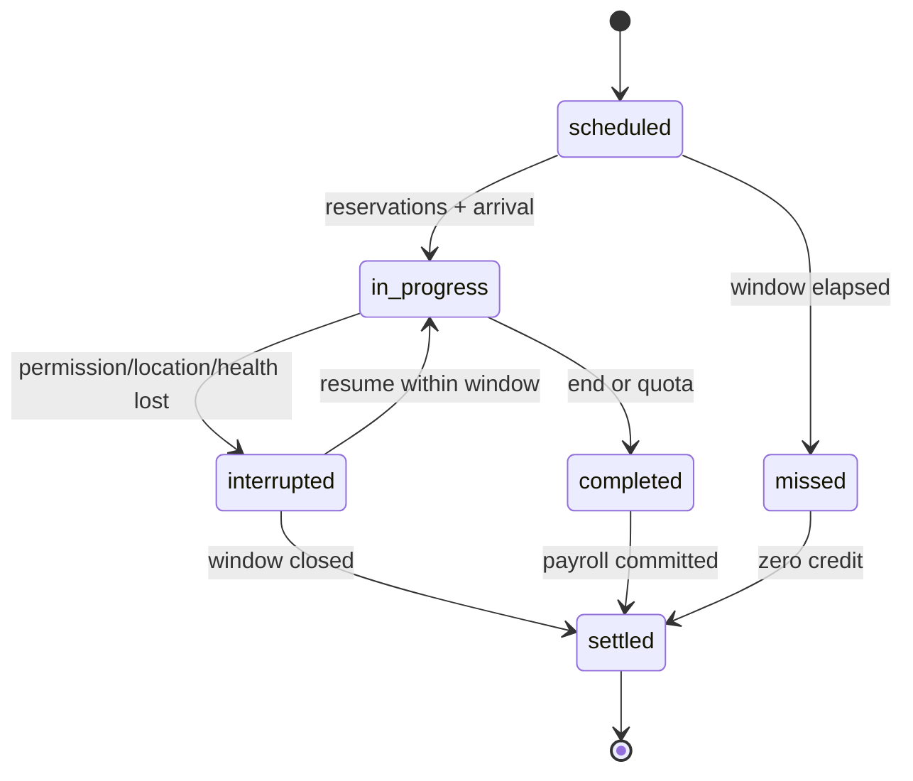

# 工作排班与收入

## 1. 目的

`REQ-ECON-003`：定义可由 TIME 调度的班次、工作进度与工资结算，确保迟到、中断、高倍速、雇主余额不足和崩溃恢复下收入不重复、不丢失。

## 2. 非目标

本文不推进 GameTime、不决定 Resident 是否想工作、不计算 Needs/健康，也不定义生产 Recipe；TIME 调度，AI 提议，ECON 只验证并结算经济结果。

## 3. 术语与定义

| 术语 | 定义 |
|---|---|
| ShiftDefinition | Contract 下的计划起止 GameTime、地点、角色与支付规则 |
| WorkSession | 一次实际到岗并持有 Reservation 的运行时进度 |
| Credited Minute | 满足地点、能力与活动条件的整数游戏分钟 |
| Wage Accrual | 尚未支付但由已提交 WorkProgressEvent 证明的应付整数铜羽 |
| Payroll Transaction | 从雇主/公共预算到账户的原子工资 Transaction |

## 4. 规则与不变量

- `RULE-ECON-009`：Shift 只用整数 `starts_at_game_time/ends_at_game_time`，必须满足 `end > start` 且首版单班最长 720 游戏分钟。
- `RULE-ECON-010`：工资按 Contract 的确定性规则结算；同一 `work_session_id + credited_minute_range` 只能计入一次。
- `RULE-ECON-011`：只有持有 worker 与 Workplace capacity Reservation、处于合法 location projection 且未暂停/中断的分钟可计入；AI 文本和动画时长不计入。
- `RULE-ECON-012`：雇主余额不足时不得制造货币；应付额进入有界 `wage_claim`，需后续明确支付、调解或法律结果。

## 5. 数据与接口

`DES-ECON-003`：

```json
{
  "schema_version": 1,
  "work_session_id": "01K1AB2CD3EF4GH5JK6MNP7QRS",
  "employment_contract_id": "01K1AB2CD3EF4GH5JK6MNP7QRT",
  "action_id": "01K1AB2CD3EF4GH5JK6MNP7QRV",
  "scheduled_start_game_time": 480,
  "scheduled_end_game_time": 720,
  "credited_until_game_time": 600,
  "credited_minutes": 120,
  "accrued_copper_feather": 90,
  "worker_reservation_id": "01K1AB2CD3EF4GH5JK6MNP7QRW",
  "workplace_reservation_id": "01K1AB2CD3EF4GH5JK6MNP7QRX",
  "state": "in_progress",
  "last_revision": 88
}
```

状态机：



## 6. 正常流程

1. ECON 发布下一班次的不可变 ShiftDefinition，TIME 按 GameTime 触发。
2. worker 到达 Workplace 后，Orchestrator 获取排他 Reservation 并创建 WorkSession。
3. TIME 以分钟区间调用 `credit_work_interval(session_id, from, to, expected_revision)`。
4. ECON 对区间去重、裁剪到班次窗口并累计 credited minutes。
5. 结束时创建 Payroll Transaction；成功后 WorkSession 转 `settled`。
6. DomainEvent 投影供 Resident/AI 获取“已支付/欠薪”事实，但 ECON 不修改其动机。

## 7. 边界情况

- GameTime `0×` 时不新增 credited minute，恢复后从已提交 `credited_until_game_time` 继续。
- `4×` 高速可批量提交连续分钟区间，结果必须与逐分钟执行相同。
- 迟到只计实际区间；提前离开不计未来工资。
- Shift 跨日以绝对 GameInstant 表示，不使用模糊本地钟点。
- 崩溃发生在工资 Transaction 前时 WorkSession 保留 accrued；发生在提交后重试由 command ID 返回原结果。

## 8. 错误与降级

返回 `shift_window_invalid`、`reservation_missing`、`worker_not_at_workplace`、`interval_overlap`、`work_session_terminal`、`payroll_insufficient_funds` 或 `stale_revision`。TIME backlog 时可合并连续 interval，但不能跳过资格、位置或守恒检查。

## 9. 安全与性能

每次 credit 最大 1440 游戏分钟，区间按 `(work_session_id, from, to)` 幂等。Workplace/Resident 投影携带 Revision，提交前重校验；按下一触发 GameTime 建索引，不逐 Tick 扫描全部班次。

## 10. 验收标准

- 正常、迟到、早退、中断、跨日与错过班次均产生唯一确定 credited minutes。
- `0.5×/1×/2×/4×` 对相同 GameTime 区间产生相同工资。
- 重复 interval、重复 payroll command 与崩溃恢复不重复支付。
- 余额不足形成 wage claim 而非负余额或 mint。
- 玩家和 AI worker 使用同一 WorkSession 状态机。

## 11. 测试追踪

| 测试 ID | 断言 |
|---|---|
| `TEST-ECON-009` | Shift 边界、跨日、迟到/早退 interval |
| `TEST-ECON-010` | credited range 幂等与 payroll exactly-once |
| `TEST-ECON-011` | `0×..4×` GameTime 等价和 batch credit |
| `TEST-ECON-012` | 中断、欠薪、崩溃恢复状态机 |

## 12. 关联文档

- `DOC-FOUNDATION-006`：GameTime 与货币单位
- `DOC-ECON-001`：Monetary Account
- `DOC-ECON-002`：Employment Contract 与 Workplace
- `DOC-ECON-006`：工资 Transaction
