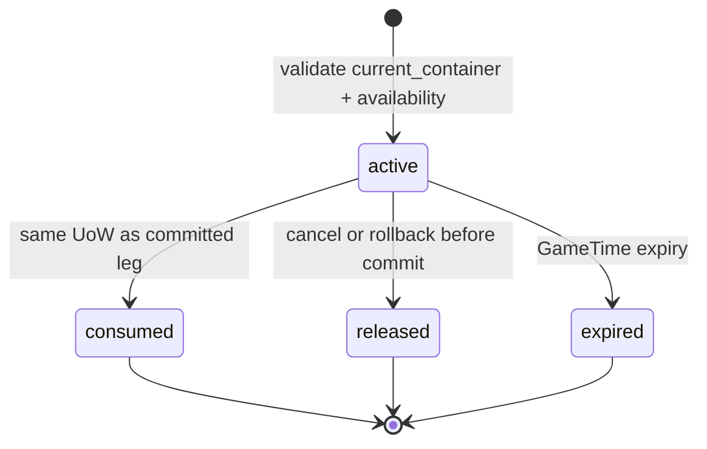

# 库存与容器规则

## 1. 目的

`REQ-ECON-005`：定义 Inventory、Container、格子、重量、类型权限与 Reservation，保证任何移动、装备、交易、制作和恢复都不会产生负数量、超容量、循环容器或重复占用。

## 2. 非目标

本文不拥有 Resident aggregate、Building 存储空间、战斗装备效果或 UI 拖放；Resident 只保存 `inventory_id`，其他 owner 通过 ECON Command 操作。

## 3. 术语与定义

| 术语 | 定义 |
|---|---|
| Inventory | ECON aggregate，具有 owner 引用、slot/weight 限额与访问策略 |
| Slot | 一个 ItemInstance 或一个可合并 Stack Batch 占用的逻辑位置 |
| Container Inventory | `item_kind=container` 实例拥有的子 Inventory |
| Effective Weight | 直接内容加允许深度内子容器内容的整数克数 |
| Resource Reservation | 对 current container 内资源或目标 capacity 的临时排他声明；只改变可用量 projection，不取得 ownership |

## 4. 规则与不变量

- `RULE-ECON-017`：Inventory 的 `used_slots <= max_slots`、`total_weight_grams <= max_weight_grams`，且 quantity、slots、weight 均不得为负。
- `RULE-ECON-018`：容器嵌套最大深度为 2，禁止自身包含、祖先循环和把容器移动进其后代。
- `RULE-ECON-019`：访问必须满足 `access_policy`；Client/AI 声称 `can_access=true` 无效，私人住宅/容器遵守 WORLD consent 规则。
- `RULE-ECON-020`：Reservation 状态只允许 `active/consumed/released/expired`；active 数量计入可用量扣减但不改变 `current_container`，同一资源不得超额预留。

## 5. 数据与接口

`DES-ECON-005`：

```json
{
  "schema_version": 1,
  "inventory_id": "01K1AB2CD3EF4GH5JK6MNP7QRS",
  "owner_entity_id": "01K1AB2CD3EF4GH5JK6MNP7QRT",
  "inventory_kind": "resident",
  "max_slots": 24,
  "max_weight_grams": 30000,
  "used_slots": 7,
  "total_weight_grams": 12540,
  "access_policy_id": "inventory_policy.owner_and_authorized_trade",
  "parent_container_item_id": null,
  "state": "active",
  "version": 12
}
```

Reservation：

```json
{
  "reservation_id": "01K1AB2CD3EF4GH5JK6MNP7QRV",
  "owner_action_id": "01K1AB2CD3EF4GH5JK6MNP7QRW",
  "binding_id": "transaction_leg.01K1AB2CD3EF4GH5JK6MNP7QRY",
  "resource_kind": "item_quantity",
  "resource_id": "01K1AB2CD3EF4GH5JK6MNP7QRX",
  "resource_version": 7,
  "source_inventory_id": "01K1AB2CD3EF4GH5JK6MNP7QRS",
  "holder_actor_id": "01K1AB2CD3EF4GH5JK6MNP7QRZ",
  "quantity": 3,
  "created_game_time": 600,
  "expires_at_game_time": 610,
  "request_revision": 90,
  "state": "active"
}
```

Inventory 与 Reservation 使用以下 strict manifest；所有 record 与 branch 均拒绝未列字段：

```json
{
  "strict_contract_version": 1,
  "additional_properties": false,
  "inventory": {
    "exact_fields": ["schema_version", "inventory_id", "owner_entity_id", "inventory_kind", "max_slots", "max_weight_grams", "used_slots", "total_weight_grams", "access_policy_id", "parent_container_item_id", "state", "version"],
    "enums": {
      "inventory_kind": ["resident", "shop", "organization", "public", "container", "workplace", "escrow"],
      "state": ["active", "sealed", "decommissioned"]
    },
    "integer_ranges": {
      "max_slots": [1, 512],
      "max_weight_grams": [0, 10000000],
      "used_slots": [0, 512],
      "total_weight_grams": [0, 10000000],
      "version": [0, 9223372036854775807]
    },
    "references": {
      "inventory_id": "runtime_ulid",
      "owner_entity_id": "runtime_or_stable_entity_id",
      "access_policy_id": "stable_catalog_id",
      "parent_container_item_id": "nullable_container_item_instance"
    }
  },
  "reservation": {
    "exact_fields": ["reservation_id", "owner_action_id", "binding_id", "resource_kind", "resource_id", "resource_version", "source_inventory_id", "holder_actor_id", "quantity", "created_game_time", "expires_at_game_time", "request_revision", "state"],
    "enums": {
      "resource_kind": ["currency_amount", "unique_item", "item_quantity", "inventory_slot", "inventory_weight", "workplace_capacity", "craft_station", "property_deed"],
      "state": ["active", "consumed", "released", "expired"]
    },
    "references": {
      "reservation_id": "runtime_ulid",
      "owner_action_id": "action_runtime_id",
      "binding_id": "immutable_transaction_leg_or_craft_input_id",
      "resource_id": "resource_kind_selected_aggregate",
      "source_inventory_id": "nullable_inventory",
      "holder_actor_id": "resident_or_system_actor"
    },
    "integer_ranges": {
      "resource_version": [0, 9223372036854775807],
      "quantity": [1, 9223372036854775807],
      "created_game_time": [0, 9223372036854775807],
      "expires_at_game_time": [1, 9223372036854775807],
      "request_revision": [0, 18446744073709551615]
    }
  },
  "resource_branches": {
    "unique_item": {"resource_ref": "item_instance", "quantity_constant": 1, "source_inventory_required": true},
    "property_deed": {"resource_ref": "property_deed_item_instance", "quantity_constant": 1, "source_inventory_required": true},
    "item_quantity": {"resource_ref": "stack_batch", "source_inventory_required": true},
    "currency_amount": {"resource_ref": "monetary_account", "source_inventory_required": false},
    "inventory_slot": {"resource_ref": "target_inventory", "source_inventory_required": false},
    "inventory_weight": {"resource_ref": "target_inventory", "source_inventory_required": false},
    "workplace_capacity": {"resource_ref": "workplace", "source_inventory_required": false},
    "craft_station": {"resource_ref": "workplace_station", "source_inventory_required": false}
  }
}
```

Item/Batch Reservation 必须断言 `resource.current_container.inventory_id == source_inventory_id` 且 `resource_version` 匹配；`binding_id` 在一个 Action 内唯一并与待提交 leg/input 不可变绑定。Inventory 引用约束为：container kind 必须由一个 `item_kind=container` 的 `kind_data.child_inventory_id` 反向唯一引用；非 container 的 `parent_container_item_id=null`。

Reservation 状态机：



## 6. 正常流程

1. 调用方请求 `preview_transfer(source, target, items, revision)`。
2. ECON 校验权限、可用 quantity、目标 slot/weight、容器深度与 type restriction。
3. 按 `appropriation -> encumbrance -> currency_account -> inventory -> item_or_batch -> workplace -> property`，同类按 stable resource key 升序获取 Reservation。
4. Transaction 消费 Reservation 并原子更新 source/target Inventory 与 ownership。
5. 未消费 Reservation 由明确取消/rollback 转 `released` 或 GameTime 到期转 `expired`；这些转换只移除 availability overlay，`current_container` 不变。

## 7. 边界情况

- Stack 部分转移先 Reservation quantity，再在提交时确定性拆 batch。
- 目标已有可合并 stack 时不新增 slot，但仍检查重量。
- 把空容器放入容器也计容器自重；子内容重量不可隐藏。
- arrival/交易中断时 active Reservation 可按 `resource_id + resource_version + source_inventory_id + binding_id` 恢复；不凭网络断开立即释放或消费。
- Inventory owner 被俘、昏迷或 Building 被封锁不转移 ownership，只影响访问 projection。

## 8. 错误与降级

返回 `inventory_access_denied`、`insufficient_quantity`、`slot_limit_exceeded`、`weight_limit_exceeded`、`container_cycle`、`container_depth_exceeded`、`reservation_conflict` 或 `reservation_expired`。UI 投影延迟时只重新拉取，不乐观提交。

## 9. 安全与性能

每次 Command 最多涉及 64 个 item/batch，容器遍历深度固定 2；总重量作为缓存字段但提交时从受影响树增量复核。Reservation 查询按 resource key 索引，恢复时全量检查 active 总和不超过资源量、所有 source/current container 一致且每个 binding 唯一。

## 10. 验收标准

- slot、weight、type restriction、访问与容器深度均有通过/拒绝 fixture。
- stack 部分预留和两个并发买家不会超卖。
- GameTime 暂停、到期、取消、崩溃恢复下 Reservation 状态唯一。
- Resident 只引用 InventoryId，不能直接写 Item quantity。
- 重放后缓存重量/slot 与内容重算完全一致。

## 11. 测试追踪

| 测试 ID | 断言 |
|---|---|
| `TEST-ECON-017` | slot/weight/type 限额与增量缓存重算 |
| `TEST-ECON-018` | 容器循环、深度和子内容重量 |
| `TEST-ECON-019` | 私人访问、玩家/NPC 权限 parity |
| `TEST-ECON-020` | Reservation 并发、暂停、过期与恢复 |

## 12. 关联文档

- `DOC-WORLD-008`：私人容器与同意
- `DOC-ECON-004`：Item 与 ownership
- `DOC-ECON-006`：Reservation 消费与事务
- `DOC-MAP-008`：Door Reservation 是 MAP 自有的独立资源类型
