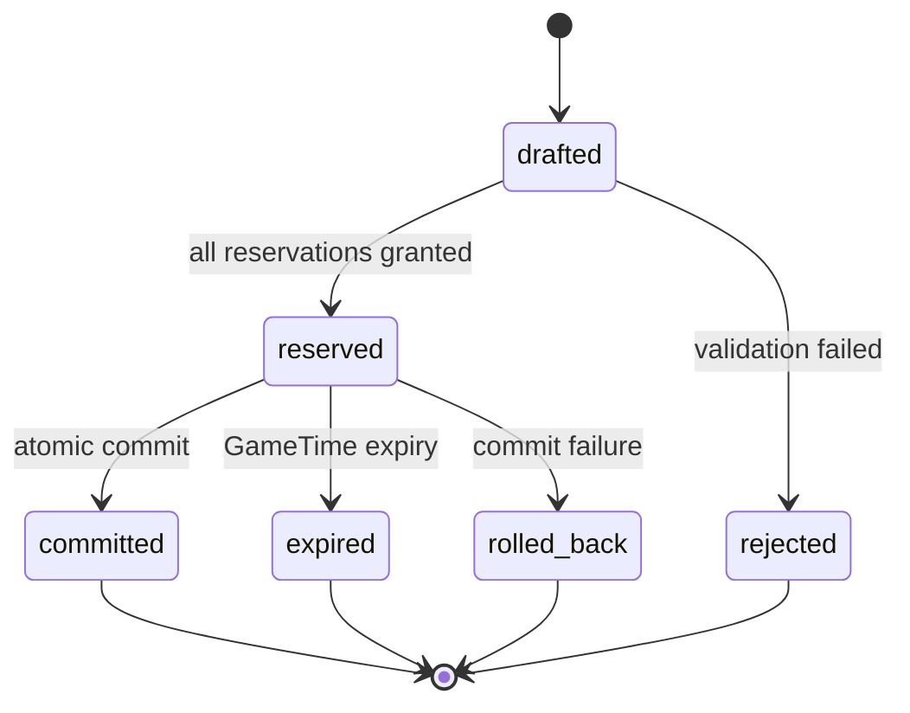

# 原子交易模型

## 1. 目的

`REQ-ECON-006`：定义付款、收款、税费、Item ownership、Inventory 占用、Reservation 和 DomainEvent 的单事务提交协议，抵御重试、并发、过期 Revision、崩溃与 double-spend。

## 2. 非目标

本文不定义 API Envelope、SQLite 表布局、具体商品价格或法律裁决；BACKEND 编排 Unit of Work，ECON 拥有交易规则与结果。

## 3. 术语与定义

| 术语 | 定义 |
|---|---|
| Economy Transaction | 一组必须全成或全败的 currency/item/inventory legs |
| Idempotency Key | `(world_id, command_id)`，重复命令返回原结果 |
| Strict Revision | Transaction 必须匹配的 `expected_revision` |
| Double-spend | 同一余额、Item 或 batch quantity 被两个并发命令重复消费 |
| Rollback | 提交前失败后撤销写集；不生成伪造的成功 DomainEvent |

## 4. 规则与不变量

- `RULE-ECON-021`：Transaction 的 currency legs、item legs、Inventory 统计、Reservation/Encumbrance 状态、Appropriation 计数、idempotency result 与不可丢 DomainEvent 必须在同一事务提交。
- `RULE-ECON-022`：相同 command ID 最多提交一次；payload hash 不同却复用 command ID 时返回冲突，不得返回旧成功伪装新请求。
- `RULE-ECON-023`：提交前在最新 Revision 重新验证余额、ownership、quantity、capacity、权限、Quote 与全部 active Reservation；任一变化使全体失败。
- `RULE-ECON-024`：资源锁/Reservation 获取顺序遵循 `DOC-ECON-005` 的全序；任何死锁、超时、写失败或 invariant violation 都回滚且 Revision 不增长。

## 5. 数据与接口

`DES-ECON-006`：

```json
{
  "schema_version": 1,
  "transaction_id": "01K1AB2CD3EF4GH5JK6MNP7QRS",
  "command_id": "01K1AB2CD3EF4GH5JK6MNP7QRT",
  "expected_revision": 120,
  "kind": "shop_sale",
  "quote_id": "01K1AB2CD3EF4GH5JK6MNP7QRV",
  "reservation_ids": ["01K1AB2CD3EF4GH5JK6MNP7QRW"],
  "currency_legs": [
    {"account_id": "01K1AB2CD3EF4GH5JK6MNP7QRX", "delta_copper_feather": -110},
    {"account_id": "01K1AB2CD3EF4GH5JK6MNP7QRY", "delta_copper_feather": 100},
    {"account_id": "01K1AB2CD3EF4GH5JK6MNP7QRZ", "delta_copper_feather": 10}
  ],
  "item_legs": [
    {"item_or_batch_id": "01K1AB2CD3EF4GH5JK6MNP7QS0", "quantity": 1, "from_inventory_id": "01K1AB2CD3EF4GH5JK6MNP7QS1", "to_inventory_id": "01K1AB2CD3EF4GH5JK6MNP7QS2"}
  ],
  "budget_bindings": [],
  "state": "reserved"
}
```

`budget_bindings` 是每笔公共预算 debit 的强制关联；没有 public-budget debit 时必须为空。存在 public-budget debit 时，每个负数 leg 必须恰好被一条 binding 覆盖，且 `amount_copper_feather == -currency_legs[currency_leg_index].delta_copper_feather`：

```json
{
  "public_account_id": "01K1AB2CD3EF4GH5JK6MNP7QSA",
  "currency_leg_index": 0,
  "appropriation_id": "01K1AB2CD3EF4GH5JK6MNP7QSB",
  "appropriation_expected_version": 4,
  "encumbrance_id": "01K1AB2CD3EF4GH5JK6MNP7QSC",
  "encumbrance_expected_version": 1,
  "amount_copper_feather": 1800,
  "purpose_id": "public_work.road_repair"
}
```

Binding 必须且只能包含以上八个字段，`currency_leg_index>=0`、`amount_copper_feather>0`；Appropriation/Encumbrance Schema、状态与不变量由 `DOC-ECON-011` 定义。

状态机：



## 6. 正常流程

1. 从已验证 Quote/Contract/Action 构造 drafted Transaction。
2. 按资源全序申请 Reservation，并记录 payload hash 与 request Revision。
3. 单一 World Writer 在最新 Revision 重新读取写集。
4. 运行 currency conservation、unique ownership、quantity、capacity 与权限 Commit Check；公共 debit 还逐条验证 active Appropriation/Encumbrance、版本、用途、金额和账户。
5. 原子写入所有 legs、消费 Reservation/Encumbrance、更新 `spent/active_encumbrance`、DomainEvent、idempotency result，并递增 Revision 1。
6. 重复 command 直接返回原 `transaction_id/committed_revision/event_ids`。

## 7. 边界情况

- 两个买家争抢最后一件 unique Item 时只允许持有 Reservation 的 Transaction 提交。
- Quote 未过期但库存/权限变化仍需重校验；Quote 不是 Reservation。
- 税率变化导致 quote revision 过期时拒绝重报价，不能静默改总价。
- 两个 Transaction 竞争同一 Appropriation 余量时，按 `appropriation_id -> encumbrance_id -> account_id` 锁定；后提交者必须因版本或剩余额度失败。
- Crash 在数据库 commit 前无任何可见变化；commit 后 Outbox 未发送时恢复重发同一事件。
- 退款/撤销是新的反向 Transaction，不能删除或改写原 Transaction。

## 8. 错误与降级

返回 `idempotency_payload_conflict`、`stale_revision`、`quote_expired`、`reservation_conflict`、`budget_binding_missing`、`encumbrance_mismatch`、`double_spend_detected`、`transaction_invariant_failed` 或 `persistence_failed`。降级只能重新报价/重规划，不允许拆分为“先扣钱后给物”。

## 9. 安全与性能

服务端从 Catalog/Quote 计算 legs，忽略 Client/AI 自报税额和 owner。单 Transaction 最多 64 item legs、16 currency legs；锁等待有界，超时回滚。日志只记录 ID、金额汇总与 reason code，不记录私人对话。

## 10. 验收标准

- 付款、收款、税费与 ownership 在同一 Revision 可见。
- 每个故障注入点均为全成或全败，无中间持久状态。
- 重复 command 返回同一结果；同 ID 不同 payload 被拒绝。
- 并发最后一件商品、同一余额和同一 batch 不 double-spend。
- 退款以新 Transaction 表达且两条历史均可重放。

## 11. 测试追踪

| 测试 ID | 断言 |
|---|---|
| `TEST-ECON-021` | sale/tax/item/inventory/event 原子性 |
| `TEST-ECON-022` | command idempotency 与 payload hash 冲突 |
| `TEST-ECON-023` | 并发 double-spend 与 stable lock order |
| `TEST-ECON-024` | 每个 crash boundary、rollback、Outbox 重发与 refund |

## 12. 关联文档

- `DOC-FOUNDATION-002`：Unit of Work 与 Outbox
- `DOC-FOUNDATION-005`：守恒、幂等、Revision 与原子事件
- `DOC-ECON-005`：Reservation 与资源顺序
- `DOC-ECON-012`：恢复和并发测试矩阵
