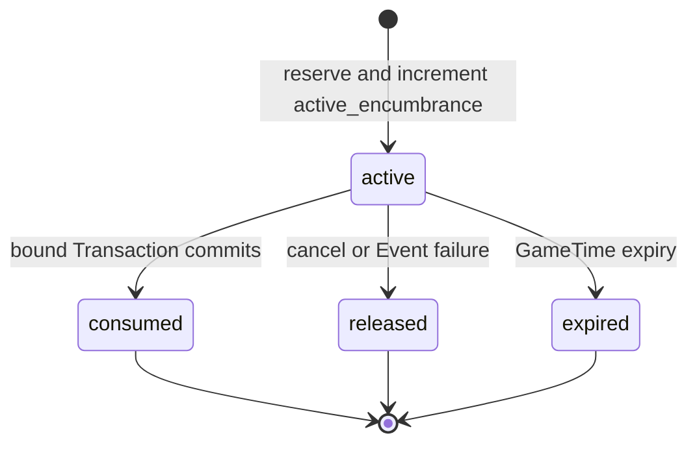

# 财产、建筑引用与公共预算

## 1. 目的

`REQ-ECON-011`：定义 PropertyDeed、私人/组织/公共经济权益与公共预算拨款，使地契转移、建设材料支付、工资、税和赔偿受产权、预算、许可及原子 Transaction 约束。

## 2. 非目标

本文不拥有 Building aggregate、Footprint、Collision、施工/损坏状态机、地图许可区或镇长权限；EVENT/WORLD/MAP/PLAYER owner 提供已验证 subject、许可和状态，ECON 不直接修改。

## 3. 术语与定义

| 术语 | 定义 |
|---|---|
| PropertyDeed | `item_kind=property_deed` 的 unique Item，引用一个登记 property subject |
| Property Subject | EVENT 或 WORLD owner 的 land parcel、Building 或经营权 Stable/Runtime ID |
| Beneficial Owner | 由当前 Deed ownership 派生的经济权益主体 |
| Public Budget | `account_kind=public_budget` 的 Monetary Account 与拨款控制 aggregate |
| Appropriation | 对用途、上限、有效期与批准证据的预算授权 |
| Encumbrance | 为已批准采购/工资/施工预留的预算 Reservation |

## 4. 规则与不变量

- `RULE-ECON-041`：每个可转让 Property Subject 最多有一份 active PropertyDeed；Deed unique ownership 与 subject index 必须同事务一致。
- `RULE-ECON-042`：Deed 转移必须验证上位法律、owner 同意/裁定、税费、接收能力与 subject version；镇长不能以管理模式直接没收私人财产。
- `RULE-ECON-043`：公共支出必须通过 active Encumbrance 强绑定 active Appropriation；始终满足 `spent + active_encumbrance <= authorized_copper_feather`，且 Transaction debit、binding amount 与 Encumbrance amount 三者相等，余额与授权上限均不得透支。
- `RULE-ECON-044`：Building 规划/清理/地基/主体/设施/验收阶段由 EVENT 拥有；ECON 只结算 land right、材料、工具、劳动力、税费和预算，并通过 Event/Command Port 回报经济完成。

## 5. 数据与接口

`DES-ECON-011`：

```json
{
  "schema_version": 1,
  "deed_item_id": "01K1AB2CD3EF4GH5JK6MNP7QRS",
  "property_subject": {
    "subject_kind": "building",
    "subject_id": "01K1AB2CD3EF4GH5JK6MNP7QRT",
    "subject_version": 3
  },
  "rights": ["occupy", "lease", "transfer"],
  "encumbrance_ids": [],
  "issued_event_id": "01K1AB2CD3EF4GH5JK6MNP7QRV",
  "state": "active"
}
```

Appropriation 的 `state` 只允许 `draft/active/exhausted/expired/revoked`，并增加单调 `version` 字段；`draft` 不可预留，`revoked/expired` 不接受新 Encumbrance，`spent` 历史不回退。Encumbrance 是独立 versioned ECON aggregate：

```json
{
  "schema_version": 1,
  "encumbrance_id": "01K1AB2CD3EF4GH5JK6MNP7QRZ",
  "appropriation_id": "01K1AB2CD3EF4GH5JK6MNP7QRW",
  "public_account_id": "01K1AB2CD3EF4GH5JK6MNP7QRX",
  "owner_command_id": "01K1AB2CD3EF4GH5JK6MNP7QS0",
  "purpose_id": "public_work.road_repair",
  "amount_copper_feather": 1800,
  "created_game_time": 10100,
  "expires_at_game_time": 11000,
  "state": "active",
  "version": 1
}
```

Encumbrance 字段集合固定如上且拒绝额外字段；状态只允许 `active/consumed/released/expired`。`amount_copper_feather>0`，account/purpose 必须逐字段等于 Appropriation，`owner_command_id` 是创建幂等键的一部分。



创建 active Encumbrance 与 `Appropriation.active_encumbrance += amount` 同一事务；consume 与公共 debit、`active_encumbrance -= amount`、`spent += amount` 同一事务；release/expire 只执行 `active_encumbrance -= amount`。任一分支重试按 command ID/encumbrance ID 返回原结果。

```json
{
  "appropriation_id": "01K1AB2CD3EF4GH5JK6MNP7QRW",
  "public_account_id": "01K1AB2CD3EF4GH5JK6MNP7QRX",
  "purpose_id": "public_work.road_repair",
  "authorized_copper_feather": 5000,
  "spent_copper_feather": 1200,
  "active_encumbrance_copper_feather": 1800,
  "starts_at_game_time": 10080,
  "expires_at_game_time": 20160,
  "approval_evidence_id": "01K1AB2CD3EF4GH5JK6MNP7QRY",
  "state": "active",
  "version": 4
}
```

## 6. 正常流程

1. Orchestrator 获取 Property Subject/许可/镇长权限的 revision-stamped projection。
2. ECON 校验 active Deed、转让同意或合法裁定，并报价税费。
3. 原子预留 Deed、买方付款、接收 Inventory capacity 与公共税账户。
4. Transaction 转移 Deed ownership、资金与税费并追加事件。
5. 公共工程先激活 Appropriation，再原子创建 Encumbrance 并增加 active encumbrance；锁顺序固定为 `appropriation -> encumbrance -> public_account`。
6. EVENT 确认阶段完成后，Transaction 的 public debit 以 `budget_bindings[]` 引用该 Appropriation/Encumbrance 并原子 consume；阶段失败则原子 release，Building 状态仍由 EVENT 决定。

## 7. 边界情况

- Building 被毁不自动销毁 Deed；subject state 影响价值/使用权，但历史 ownership 保留。
- Deed 丢失表现不等于产权消失；权威 Item 仍在 Inventory/托管位置。
- 公共预算余额充足但 Appropriation 不足仍拒绝支出。
- Appropriation 到期时已 committed 支出保留，active 未消费 Encumbrance 释放。
- 两个并发命令申请同一剩余额度时，只有一个能增加 active encumbrance；另一个因 version/available amount 失败且不得创建孤儿 Encumbrance。
- Crash 发生在数据库 commit 前保持旧 `spent/active_encumbrance`；commit 后恢复从 Transaction binding 与 Encumbrance terminal state 重建，不重复 debit 或释放。
- 紧急公共支出必须引用 WORLD emergency 分类与 PLAYER/BACKEND 审计，不能绕过总额守恒。

## 8. 错误与降级

返回 `property_subject_unknown`、`deed_conflict`、`transfer_consent_missing`、`property_version_stale`、`appropriation_missing`、`appropriation_exceeded`、`encumbrance_state_invalid`、`budget_binding_missing`、`public_budget_insufficient` 或 `building_owner_boundary_violation`。EVENT 不可用时保持资金/材料 Reservation 与 Encumbrance 到有界恢复点，随后原子释放，不自行推进施工阶段。

## 9. 安全与性能

产权查询按 subject ID 建唯一索引；私人 Deed 详情只向 owner、授权交易方或有合法证据的治理查询披露。公共预算汇总可公开，私人交易明细按访问级别过滤。镇长/AI 输入不能直接指定 subject owner、余额或 Building state。

## 10. 验收标准

- 同一 Property Subject 无法出现两份 active Deed。
- 私人出售、组织转让、合法赔偿与越权没收均有确定路径。
- 公共账户余额和 Appropriation 两层限制同时强制。
- 每笔公共 debit 都可由 Transaction binding 唯一解析到 consumed Encumbrance，且三处金额一致。
- 六个 Building 阶段的经济资源可结算，但 ECON 不写阶段/Collision。
- 崩溃、许可撤销、Building 毁损与预算到期无重复支出或孤儿 Encumbrance。

## 11. 测试追踪

| 测试 ID | 断言 |
|---|---|
| `TEST-ECON-041` | Property Subject active Deed 唯一性 |
| `TEST-ECON-042` | consent/legal order/tax/越权没收 |
| `TEST-ECON-043` | budget balance + appropriation + encumbrance 守恒 |
| `TEST-ECON-044` | 六阶段 EVENT ownership 与失败恢复边界 |

## 12. 关联文档

- `DOC-WORLD-006`：镇务公共预算与私人权利
- `DOC-WORLD-008`：财产法律与程序保障
- `DOC-MAP-010`：Building geometry/Nav 更新
- `DOC-ECON-012`：预算和产权恢复测试
