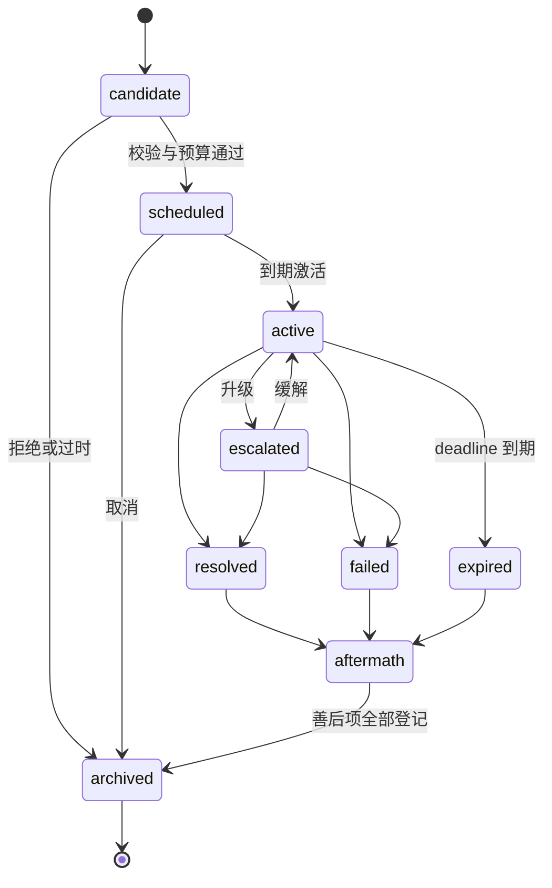

# 世界事件引擎

## 1. 目的

`REQ-EVENT-001`：定义 `WorldEvent` aggregate、与 `DomainEvent`/`Quest` 的强制分离、固定生命周期状态机、事件来源登记和引擎的提交边界，使所有持续性世界事件可追溯、可重放且只能经 World Runtime 提交。

## 2. 非目标

本文不定义触发条件与叙事压力（`DOC-EVENT-002`）、AI Event Director（`DOC-EVENT-003`）、Quest 结构（`DOC-EVENT-004`）、后果传播（`DOC-EVENT-005`）或天气（`DOC-EVENT-006`）。本文也不重新定义 `DomainEvent` Envelope；其 canonical 定义在 `DOC-FOUNDATION-004` 与 `RULE-FOUNDATION-021`。

## 3. 术语与定义

| 术语 | 定义 |
|---|---|
| WorldEvent | 跨 GameTime 持续、有生命周期与影响范围的 EVENT aggregate；不是事实本身 |
| EventTemplate | 注册在 Stable Catalog 的事件模板：类型、参数 Schema、severity、允许来源与阶段策略 |
| Event Source | 产生 WorldEvent 候选的登记来源类别 |
| Lifecycle Transition | WorldEvent 状态机中一次原子状态变化，总是伴随一个 DomainEvent |
| Scope | WorldEvent 影响范围声明：scene、区域 AABB、实体集合或全世界 |
| Aftermath Task | Resolved/Failed/Expired 后登记的结构化善后项，由 `DOC-EVENT-005` 消费 |

## 4. 规则与不变量

- `RULE-EVENT-001`：`DomainEvent`、`WorldEvent`、`Quest` 遵循 `RULE-FOUNDATION-013` 强制分离：`DomainEvent` 是已提交原子事实；`WorldEvent` 与 `Quest` 是可持续 aggregate，其每次状态变化都必须由一个 `DomainEvent` 表达；任何代码不得以 `WorldEvent` 当前字段替代 Event Log 作为事实来源。
- `RULE-EVENT-002`：WorldEvent 生命周期固定为 `candidate → scheduled → active → escalated | resolved | failed | expired → aftermath → archived`；`active ↔ escalated` 可往返一次以上，但除图中列出的边外不存在任何转换，且每次 Lifecycle Transition 与状态写入、DomainEvent 按 `RULE-FOUNDATION-029` 原子提交。
- `RULE-EVENT-003`：WorldEvent 只能由注册 `EventTemplate` 实例化（`REQ-PRODUCT-017`）；实例必须携带 `event_template_id` 与通过该模板参数 Schema 校验的参数，不存在自由形态事件类型。
- `RULE-EVENT-004`：Event Source 枚举固定为 `time/state/resident/player/environment/director/admin`；每个 WorldEvent 记录其来源与来源证据 ID；`admin` 来源必须满足 `RULE-FOUNDATION-030` 的审计与永久标记。
- `RULE-EVENT-005`：时间驱动的 Lifecycle Transition（scheduled 到点激活、active 到点过期、aftermath 收尾）必须通过 TIME Scheduled Event（phase 4，`RULE-TIME-044`）到期执行，禁止逐 Tick 扫描 WorldEvent 全表。
- `RULE-EVENT-006`：EVENT 引擎不直接写他域状态；对居民、经济、地图或战斗的影响只能通过对应 owner 的 Command/Event Port 传播（`DOC-EVENT-005`），且全部提交仍由 World Runtime 执行（`RULE-FOUNDATION-016`）。

## 5. 数据与接口

`DES-EVENT-001`：WorldEvent aggregate 持久形态：

```json
{
  "schema_version": 1,
  "world_event_id": "01K1AB2CD3EF4GH5JK6MNP7QRS",
  "event_template_id": "event.disaster.forest_fire",
  "source": "environment",
  "source_evidence_id": "01K1AB2CD3EF4GH5JK6MNP7QRT",
  "severity": "major",
  "state": "active",
  "scope": {
    "scope_kind": "area",
    "scene_id": "region.twilight_whisper_forest",
    "bounds_wu": [512, 512, 1536, 1536]
  },
  "parameters": {
    "spread_rate_per_game_hour": 2,
    "ignition_point": {"scene_id": "region.twilight_whisper_forest", "x_wu": 900.0, "y_wu": 700.0}
  },
  "scheduled_start_game_time": 12600,
  "deadline_game_time": 13320,
  "aftermath_task_ids": [],
  "version": 3
}
```

`severity` 枚举与预算权重由 `DOC-EVENT-002` canonical 定义；`parameters` 的合法键集合由 `event_template_id` 对应模板 Schema 决定，拒绝额外字段。所有 ID 遵循 `RULE-FOUNDATION-031..033`。

接口：

```text
instantiate_event(command_id, event_template_id, source, parameters, scope) -> WorldEventResult
transition_event(command_id, world_event_id, expected_version, target_state, evidence) -> TransitionResult
list_active_events(scene_id | null) -> RevisionStampedProjection
register_aftermath_task(command_id, world_event_id, task) -> AftermathTaskResult
```



## 6. 正常流程

1. 某个 Event Source 产生候选（`DOC-EVENT-002` 触发评估或 `DOC-EVENT-003` Director 提案）。
2. 引擎按模板 Schema、Scope 合法性与叙事压力预算校验候选。
3. 通过后原子提交 `candidate → scheduled`，并注册 TIME Scheduled Event 指向激活时刻。
4. 到期 handler 在最新 Revision 复验前置条件后提交 `scheduled → active`。
5. active 期间的世界影响由 `DOC-EVENT-005` 定义的传播端口执行。
6. 终态到达后登记 Aftermath Task，全部登记完成提交 `aftermath → archived`。

## 7. 边界情况

- scheduled 事件到期时前置条件已失效（目标建筑已拆除、区域封锁）：提交 `scheduled → archived` 并记录原因码，不强行激活。
- 同一模板并发实例：允许与否由模板 `max_concurrent_instances` 声明；超出的候选在 candidate 阶段拒绝。
- `active → expired` 与手动 `resolve` 命令同分钟到达：按 Revision 先提交者生效，后者因 `expected_version` 过期拒绝（`RULE-MAP-038` 同型幂等语义）。
- 世界暂停期间 GameTime 不推进（`RULE-FOUNDATION-038`），因此无事件到期；恢复后按原 due GameTime 顺序执行。
- 存档回溯分支：WorldEvent 状态随 Snapshot + Event Log 重建，不从当前墙钟重新推导。

## 8. 错误与降级

校验失败返回 `event_template_unknown`、`parameters_invalid`、`scope_invalid`、`budget_exceeded`、`state_transition_illegal`、`version_stale` 或 `source_not_permitted`，均不产生状态变化。TIME 队列过载时事件激活随 phase 4 顺延，但 deadline 判定仍以 GameTime 为准；恢复审计发现状态机非法状态时保持 Recovery Barrier，不自动修复。

## 9. 安全与性能

WorldEvent 参数与理由文本不得包含未授权 Secret（`RULE-FOUNDATION-024`）；`admin` 来源事件在存档中永久可见。active 事件查询走按 `(scene_id, state)` 的投影索引；单世界同时 active WorldEvent 上限 16，超出的候选拒绝。模板注册在构建期校验 Schema 与 ID 唯一性。

## 10. 验收标准

- 三概念分离：任何 WorldEvent 状态都可由其 DomainEvent 序列完整重建。
- 状态机注入全部非法转换均被拒绝且 Revision 不增长。
- 七类 Event Source 各有 fixture，`admin` 来源带审计与标记。
- 到期激活与过期在 `0.5×/1×/2×/4×` 倍率下 GameTime 语义一致。
- 逐 Tick 全表扫描在性能剖析中不出现。

## 11. 测试追踪

| 测试 ID | 断言 |
|---|---|
| `TEST-EVENT-001` | `RULE-EVENT-001..002` 生命周期合法/非法转换与事件重建 |
| `TEST-EVENT-002` | `RULE-EVENT-003..004` 模板实例化、参数拒绝与来源审计 |
| `TEST-EVENT-003` | `RULE-EVENT-005..006` TIME 队列驱动转换与他域端口边界 |

## 12. 关联文档

- `DOC-FOUNDATION-004`：`DomainEvent`/`WorldEvent`/`Quest` 术语与 `RULE-FOUNDATION-013`
- `DOC-FOUNDATION-005`：原子提交与 Revision 不变量
- `DOC-TIME-008`：Scheduled Event 全序与 phase
- `DOC-EVENT-002`：触发条件与叙事压力预算
- `DOC-EVENT-005`：后果传播端口
