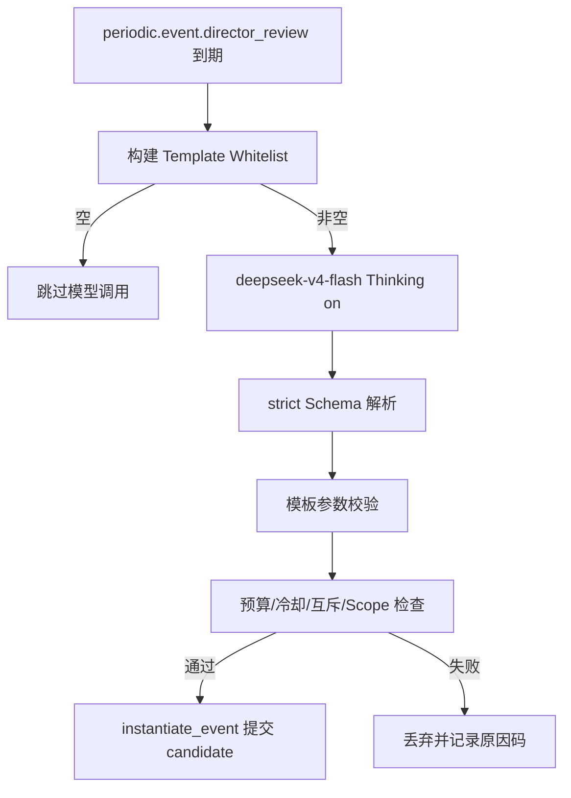

# AI Event Director

## 1. 目的

`REQ-EVENT-003`：定义 AI Event Director 的输入投影、`DirectorProposalV1` 输出契约、模板限定权限、模型调用策略（`deepseek-v4-flash` + 显式 Thinking）与调用预算，使 Director 只能建议注册事件而永远无法直接改写数据库。

## 2. 非目标

本文不定义模型 Provider 适配、重试与并发调度（`DOC-AI-007..009` canonical）、EventTemplate 目录内容（`DOC-EVENT-001`）或预算记账（`DOC-EVENT-002`）。Director 不替代居民认知管线：居民个体决策仍由 `DOC-AI-001..006` 定义。

## 3. 术语与定义

| 术语 | 定义 |
|---|---|
| Director Review | 一次周期性的叙事评估：构建输入投影、可选地调用模型、产出至多一个提案 |
| World Summary Projection | 只含公开/统计信息的 revision-stamped Director 输入 |
| DirectorProposalV1 | Director 唯一输出工件：模板选择 + 受限参数 + 理由 |
| Template Whitelist | 本次 Review 中按预算与冷却预筛后允许提案的 EventTemplate 集合 |
| Proposal Pipeline | 提案从解析到 candidate 提交所经过的标准校验链 |

## 4. 规则与不变量

- `RULE-EVENT-013`：Director 输入只能是 World Summary Projection：公开事件历史、active WorldEvent 摘要、预算与冷却状态、日历/天气/经济公开统计、匿名化居民聚合指标。私人记忆、Secret、未公开关系与完整对话不得进入（`RULE-FOUNDATION-020/024`）。
- `RULE-EVENT-014`：Director 唯一输出是 `DirectorProposalV1`，strict Schema（`additionalProperties=false`）：只能从 Template Whitelist 选择 `event_template_id` 并填写模板声明的受限参数；不得包含 Revision、实体创建、状态字段、伤害数值、坐标外的 geometry 或任何他域可信字段。
- `RULE-EVENT-015`：Director 输出不能直接改数据库：提案必须完整通过 Proposal Pipeline——Schema 解析、模板参数校验、`DOC-EVENT-002` 预算/冷却/互斥检查、Scope 合法性——再以 `source="director"` 走 `DOC-EVENT-001` `instantiate_event` 由 World Runtime 提交（`RULE-FOUNDATION-016`）；管线任何一步失败即丢弃提案，格式修复最多一次。
- `RULE-EVENT-016`：模型调用固定 `deepseek-v4-flash`，Thinking 显式 `on` 且 `reasoning_effort=high`（对应 `DOC-AI-007` 请求表中 owner registered 的复杂/重大事件规划行），JSON Output 开启，Prompt ID `event-director/v1` 版本化注册；`reasoning_content` 按 `RULE-AI-040` 丢弃。
- `RULE-EVENT-017`：Director Review 由 EVENT 注册的 `periodic.event.director_review`（interval 360 game minutes，phase 4）驱动；每次 Review 至多 1 个提案，每游戏日 Director 来源事件上限 4；Template Whitelist 为空（预算不足、全部冷却或 crisis 已 active）时跳过模型调用，不消耗 token。
- `RULE-EVENT-018`：Director 提案与其他来源候选同权：不享有专用预算池、优先级加成或校验豁免；Director 不能提案 `admin` 专属模板，`admin` 事件仍受 `RULE-FOUNDATION-030` 约束。

## 5. 数据与接口

`DES-EVENT-003`：`DirectorProposalV1`：

```json
{
  "$schema": "https://json-schema.org/draft/2020-12/schema",
  "$id": "schema://ai-town/event/director-proposal/v1",
  "type": "object",
  "required": ["proposal_kind", "event_template_id", "parameters", "narrative_reason"],
  "properties": {
    "proposal_kind": {"const": "world_event"},
    "event_template_id": {"type": "string", "pattern": "^event\\.[a-z][a-z0-9_]*(\\.[a-z][a-z0-9_]*)+$"},
    "parameters": {"type": "object"},
    "narrative_reason": {"type": "string", "maxLength": 500}
  },
  "additionalProperties": false
}
```

`parameters` 在管线第二步以所选模板的参数 Schema 二次严格校验；`narrative_reason` 仅存档展示，不参与任何规则判定。输入投影示例：

```json
{
  "schema_version": 1,
  "revision": 4210,
  "game_time": 21600,
  "budget": {"active_weight": 2, "weight_cap": 12, "crisis_active_count": 0},
  "template_whitelist": ["event.festival.harvest", "event.economy.trade_caravan"],
  "active_events": [{"event_template_id": "event.weather.mana_anomaly", "severity": "moderate", "state": "active"}],
  "recent_archived_events": ["event.disaster.forest_fire"],
  "public_stats": {"average_prosperity_0_to_1": 0.62, "open_quests": 3, "calm_game_minutes": 2880}
}
```

接口：

```text
build_director_projection(revision) -> WorldSummaryProjection
run_director_review(occurrence_key) -> DirectorReviewResult
validate_director_proposal(proposal, projection) -> ValidatedCandidate | ProposalRejection
```



## 6. 正常流程

1. Review occurrence 到期，构建 revision-stamped 投影与 Template Whitelist。
2. Whitelist 非空时按 `RULE-EVENT-016` 发起一次模型请求。
3. 响应经 strict 解析与模板校验得到候选。
4. 候选走 `DOC-EVENT-002` 裁决与预算占用。
5. 通过后以 `source="director"`、`source_evidence_id=director_review_id` 提交 candidate。
6. 记录 usage 与结果，进入下一周期。

## 7. 边界情况

- 模型返回 Whitelist 之外的模板：模板校验失败即丢弃，不做二次机会。
- 模型响应超时或非法 JSON 且一次修复失败：本次 Review 无提案，不顺延补偿，下一 occurrence 正常执行。
- Review 执行期间世界被暂停恢复：投影 Revision 已过期时重建投影再校验，不用旧投影提交。
- 提案通过校验但提交时 `budget_exceeded`（同批其他来源先占用）：按 `RULE-EVENT-018` 同权失败，不回滚他人。
- 玩家关闭 API Key 或模型不可用：Director 静默停摆，世界仍由 `DOC-EVENT-002` 规则触发维持运转，无降级 Director 本地生成器。

## 8. 错误与降级

原因码：`proposal_schema_invalid`、`template_not_whitelisted`、`template_parameters_invalid`、`budget_exceeded`、`cooldown_active`、`projection_stale`、`model_unavailable`。模型故障分类沿用 `DOC-AI-007` failure enum；Director 连续 3 次 `terminal` 失败时发布诊断事件并延长 Review 间隔至 1440 game minutes，直至一次成功后恢复。

## 9. 安全与性能

投影构建器是 Secret 边界的强制点：字段白名单构建期校验，输出进入 Prompt 前经 sink audit（`RULE-FOUNDATION-024`）。Director 请求走普通 AI 并发预算（`DOC-AI-009`），不抢占玩家对话与战斗优先级；单请求 `max_output_tokens` 上限 2048。`narrative_reason` 按纯文本渲染，不作为 HTML 执行。

## 10. 验收标准

- 架构测试证明 Director 输出路径上不存在任何直接数据库写入（`DOC-FOUNDATION-002` 架构不变量）。
- 注入含 Revision/状态/额外字段的提案全部被 strict Schema 拒绝。
- Whitelist 为空时模型调用计数为 0。
- Thinking/`reasoning_effort` 快照与 `RULE-EVENT-016` 一致。
- 30 游戏日模拟中 Director 来源事件不超过每日 4 个且全部可追溯到 Review occurrence。

## 11. 测试追踪

| 测试 ID | 断言 |
|---|---|
| `TEST-EVENT-007` | `RULE-EVENT-013..014` 投影字段白名单与 strict 提案 Schema |
| `TEST-EVENT-008` | `RULE-EVENT-015..016` 管线不可绕过、无直接写库、模型策略快照 |
| `TEST-EVENT-009` | `RULE-EVENT-017..018` Review 节流、空 Whitelist 跳过与同权裁决 |

## 12. 关联文档

- `DOC-EVENT-001`：candidate 提交入口
- `DOC-EVENT-002`：预算/冷却/互斥裁决
- `DOC-AI-007`：Provider 策略与 Thinking 路由
- `DOC-AI-008..009`：token 预算与请求调度
- `DOC-FOUNDATION-002`：`events/` 模块禁止 Director 任意写状态
