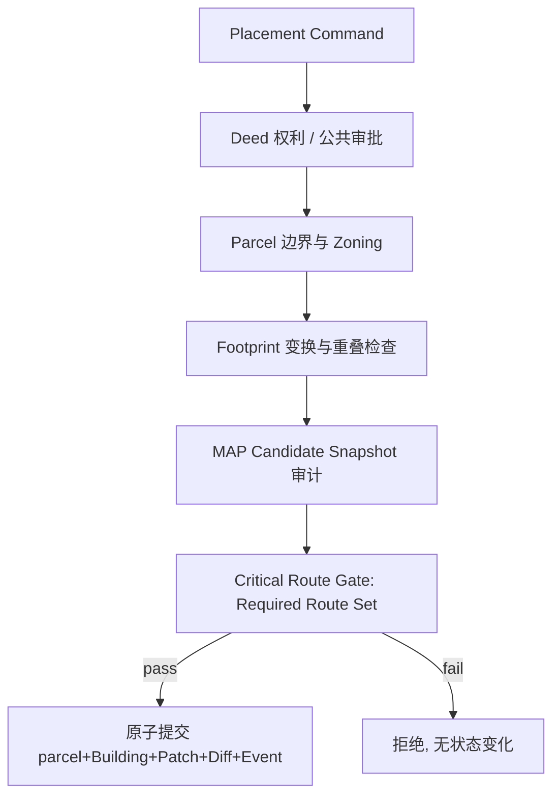

# 建筑放置规则

## 1. 目的

`REQ-EVENT-008`：定义建筑放置命令的权利/许可校验、几何与重叠约束、必需道路（Required Route）保护、Candidate Snapshot 审计流程与原子提交，使任何放置都不能切断必要通路或绕过导航校验。

## 2. 非目标

本文不定义 NavigationPatch 的几何审计算法与预算（`DOC-MAP-010` canonical）、地契交易与预算拨款（`DOC-ECON-011`）、施工资源消耗（`DOC-EVENT-009`）或镇长审批 UI 流程（PLAYER）。本文定义 EVENT 作为放置 owner 的业务校验序列与提交边界。

## 3. 术语与定义

| 术语 | 定义 |
|---|---|
| Placement Command | 引用 BuildingTemplate、land parcel 与朝向的放置请求 |
| Land Parcel | WORLD/EVENT 登记的地块 Property Subject，含边界 Polygon 与用途分区 |
| Required Route Set | 注册的 must-remain-open 路线集合：Semantic Exit 对、公共设施入口 |
| Placement Audit | 在 Candidate Snapshot 上执行的完整放置校验（`DOC-MAP-010`） |
| Zoning | parcel 的允许建筑类别声明（`residential/commercial/production/public`） |
| Orientation | 放置朝向，只允许 `0/90/180/270` degrees（`RULE-FOUNDATION-039` 角度约定） |

## 4. 规则与不变量

- `RULE-EVENT-043`：放置命令必须引用注册 `building_template_id` 与已登记 Land Parcel；发起者必须持该 parcel 的 active PropertyDeed `build` 权利，或为经审批的公共工程（Appropriation 证据，`DOC-ECON-011`）；镇长不能在私人 parcel 上强制放置（`RULE-ECON-042` 对偶）。
- `RULE-EVENT-044`：几何约束：模板 Footprint 经 Orientation 变换后必须完全落在 parcel 边界内，符合 parcel Zoning，且不与既有 Structure、Collision、保留区（Semantic Exit clearance、灾害疏散区）相交；Entrance Node 必须落在或邻接现有 Walkability。
- `RULE-EVENT-045`：Required Route Set 是 Stable Catalog 注册项：至少包含全部 Semantic Exit 配对路线与注册公共设施入口路线；放置不得使集合中任何路线不可达，由 `DOC-MAP-010` Critical Route Gate（`RULE-MAP-039`）在 Candidate Snapshot 上强制。
- `RULE-EVENT-046`：全部放置校验必须在 Candidate Snapshot 上完成（Schema、Polygon、clearance、actor 合法性、Required Route），任何一步失败则无状态变化；通过后才允许创建 `physical_state=foundation` 的 Building。
- `RULE-EVENT-047`：AI 居民 `build` ActionProposal 只表达意图：parcel、模板与预算来源（`RULE-AI-028`：模型不得提供 footprint、permission 或 owner）；服务器从模板与 parcel 解析实际几何与 Orientation 候选，模型字段不进入几何计算。
- `RULE-EVENT-048`：放置提交是单一 World transaction：parcel 占用标记、Building 创建、foundation geometry 的 NavigationPatch、DomainEvent 与 WorldDiff entry 同事务（`RULE-MAP-037`、`RULE-EVENT-041`）；携带 `expected_revision` 与幂等 command ID（`RULE-MAP-038`），重放返回原结果。

## 5. 数据与接口

`DES-EVENT-008`：放置命令 payload：

```json
{
  "schema_version": 1,
  "command_id": "01K1AB2CD3EF4GH5JK6MNP7QSC",
  "expected_revision": 5120,
  "actor_id": "01K1AB2CD3EF4GH5JK6MNP7QS2",
  "building_template_id": "building.residence.timber_cottage",
  "parcel_subject_id": "01K1AB2CD3EF4GH5JK6MNP7QSD",
  "orientation_degrees": 90,
  "funding": {"kind": "private", "payer_entity_id": "01K1AB2CD3EF4GH5JK6MNP7QS2"}
}
```

Required Route Set 注册项：

```json
{
  "schema_version": 1,
  "route_id": "required_route.town_east_gate_to_market",
  "scene_id": "region.crown_creek_town",
  "from_node_id": "semantic_exit.crown_creek.east_gate",
  "to_node_id": "semantic.crown_creek.market_square",
  "agent_profile_id": "profile.ground_medium",
  "reason": "public_access"
}
```

接口：

```text
validate_placement(command) -> PlacementPlan | PlacementRejection
commit_placement(command, placement_plan) -> PlacementResult
list_required_routes(scene_id) -> [RequiredRoute]
register_required_route(admin_command) -> RouteRegistryResult
```



## 6. 正常流程

1. 命令入口验证 Schema、`expected_revision` 与幂等键。
2. ECON 校验 Deed `build` 权利或公共工程 Appropriation。
3. EVENT 执行 parcel/Zoning/几何/入口检查生成 PlacementPlan。
4. MAP 以 PlacementPlan 构建 Candidate Snapshot 并执行完整审计（含 Required Route Set）。
5. 全部通过后按 `RULE-EVENT-048` 原子提交，Building 进入施工流程（`DOC-EVENT-009`）。

## 7. 边界情况

- parcel 上存在未清理 `ruins`：放置拒绝，原因码 `parcel_not_cleared`；清理走 `DOC-EVENT-010` 瓦砾流程。
- 两个并发放置命令目标相交区域：后提交者因 stale revision 重新校验（`RULE-MAP-038` 语义），不产生重叠建筑。
- Entrance 邻接的 Walkability 属于他人 parcel 的私有道路：入口合法性要求邻接公共 Walkability 或取得通行地役权利声明，否则拒绝。
- Required Route 恰好穿过 parcel 内部：放置可通过当且仅当 Candidate 上仍存在满足 agent profile 的替代路径；Gate 只关心可达性，不保护原路径形状。
- 公共工程在私人 parcel：必须先经 ECON/WORLD 的合法征收程序转移 Deed，放置命令本身不处理征收。

## 8. 错误与降级

原因码：`deed_right_missing`、`zoning_violation`、`footprint_out_of_parcel`、`overlap_detected`、`entrance_unreachable`、`critical_route_cut`（透传 MAP）、`parcel_not_cleared`、`stale_revision`。MAP 审计预算超限（`patch_budget_exceeded`）时拒绝并提示拆分模板，EVENT 不重试更大预算。

## 9. 安全与性能

Required Route Set 修改属于治理操作：新增/移除必须经镇长命令或 `admin`（`RULE-FOUNDATION-030`），且移除前需证明路线已由替代注册路线覆盖。放置校验读侧使用 revision-stamped projection；几何检查在 PlacementPlan 内一次完成，避免重复 Polygon 运算。单命令只放置一个 Building。

## 10. 验收标准

- 无 Deed 权利、越界、重叠、切断必需道路的放置全部被拒且 Revision 不增长。
- 合法放置后 foundation geometry 与导航同 Revision 可见。
- AI `build` 提案中注入 footprint/owner 字段被 Schema 拒绝。
- 并发放置竞争只产生一个成功者。
- Required Route Set 覆盖全部 Semantic Exit 配对的注册审计通过。

## 11. 测试追踪

| 测试 ID | 断言 |
|---|---|
| `TEST-EVENT-022` | `RULE-EVENT-043..044` 权利、Zoning 与几何约束 |
| `TEST-EVENT-023` | `RULE-EVENT-045..046` Required Route Gate 与 Candidate 审计 |
| `TEST-EVENT-024` | `RULE-EVENT-047..048` AI 意图边界与原子/幂等提交 |

## 12. 关联文档

- `DOC-MAP-010`：Candidate Snapshot、Critical Route Gate 与 patch 预算
- `DOC-EVENT-007`：Building 创建形态
- `DOC-EVENT-009`：放置后的施工推进
- `DOC-ECON-011`：Deed 权利与公共工程资金
- `DOC-AI-005`：`build` Action 参数与授权链
