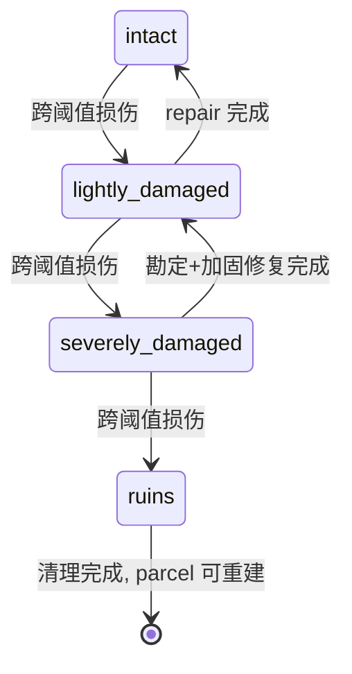

# 损毁、瓦砾与修复

## 1. 目的

`REQ-EVENT-010`：定义建筑损伤来源、Damage Points 阈值降级、瓦砾生成与搜刮、居民安置、修复与重建流程，使破坏与恢复都是原子、可追溯且不破坏导航与所有权不变量的状态变化。

## 2. 非目标

本文不定义战斗伤害公式（COMBAT）、火灾/洪水的触发概率（`DOC-EVENT-002/006`）、材料结算（ECON）或 NavigationPatch 审计（`DOC-MAP-010`）。Deed 与赔偿的经济语义由 `DOC-ECON-011` 与 `DOC-EVENT-005` 拥有。

## 3. 术语与定义

| 术语 | 定义 |
|---|---|
| Damage Source | 注册损伤来源类别：`combat/fire/flood/storm/mana_anomaly/decay/admin` |
| Damage Application | 一次已提交的损伤事实：来源、数值、证据与结果状态 |
| Damage Threshold Profile | 模板引用的阈值表：Damage Points 区间到 Physical State 的映射 |
| Rubble | `ruins` 状态生成的瓦砾 Collision 对象与可搜刮资源池 |
| Damage Assessment | 修复前的结构化勘定：状态、需求材料、劳力与工期 |
| Reconstruction | `ruins` 清理后按放置/施工流程重建 |

## 4. 规则与不变量

- `RULE-EVENT-055`：损伤只能以 Damage Application 形式由来源 owner 提交：战斗溢出由 COMBAT 结算、火灾/洪水由灾害 WorldEvent 后果端口（`RULE-EVENT-025`）、自然老化由 EVENT 周期任务、`admin` 按 `RULE-FOUNDATION-030`；损伤数值由来源 owner 公式决定，模型不得指定（`RULE-AI-028`）。
- `RULE-EVENT-056`：`damage_points` 为非负整数且有模板上限；Physical State 由 Damage Threshold Profile 唯一映射（示例：`0..9 intact`、`10..39 lightly_damaged`、`40..79 severely_damaged`、`>=80 ruins`）；每次跨阈值降级按 `RULE-EVENT-041` 同事务提交状态、目标 geometry patch、DomainEvent 与 WorldDiff。
- `RULE-EVENT-057`：转入 `ruins` 时原子生成 Rubble：瓦砾 Collision 替换建筑 Collision、注册可搜刮资源池（比例由模板声明，进入 ECON 托管）；瓦砾清理是显式长时间行动，完成后 parcel 才满足重建前置（`DOC-EVENT-008` `parcel_not_cleared`）。
- `RULE-EVENT-058`：降级导致室内不可用或 occupant 位置非法时，必须在同一事务按 `RULE-MAP-040` 灾害/恢复流程执行 safe relocation 登记；不允许把居民留在非法位置或静默传送。
- `RULE-EVENT-059`：修复路径按状态分级：`lightly_damaged` 可直接 `repair` 行动累计修复进度；`severely_damaged` 必须先完成 Damage Assessment 并满足加固材料需求；`ruins` 不可修复，只能清理后 Reconstruction 复用 parcel（新 `building_id`）；Deed 不因损毁销毁（`DOC-ECON-011` 边界），赔偿走 `DOC-EVENT-005` `compensation`。
- `RULE-EVENT-060`：修复进度与完成对称遵守施工规则：材料/劳力经 ECON 与 Work Session（`RULE-EVENT-050/051`），修复完成使 `damage_points` 原子回落到目标状态区间并提交升级后的 geometry patch；修复不产生超出 `intact` 的状态。

## 5. 数据与接口

`DES-EVENT-010`：Damage Application 与勘定：

```json
{
  "schema_version": 1,
  "damage_application_id": "01K1AB2CD3EF4GH5JK6MNP7QSF",
  "building_id": "01K1AB2CD3EF4GH5JK6MNP7QS6",
  "source": "fire",
  "source_evidence_id": "01K1AB2CD3EF4GH5JK6MNP7QRS",
  "damage_points_delta": 35,
  "resulting_damage_points": 47,
  "resulting_physical_state": "severely_damaged",
  "game_time": 26100,
  "version": 1
}
```

```json
{
  "schema_version": 1,
  "assessment_id": "01K1AB2CD3EF4GH5JK6MNP7QSG",
  "building_id": "01K1AB2CD3EF4GH5JK6MNP7QS6",
  "assessed_state": "severely_damaged",
  "repair_requirements": {
    "labor_game_minutes": 960,
    "professions": ["carpenter", "mason"],
    "materials": [
      {"item_template_id": "item.material.timber_plank", "count": 30},
      {"item_template_id": "item.material.stone_block", "count": 10}
    ]
  },
  "valid_until_game_time": 30420,
  "version": 1
}
```

接口：

```text
apply_damage(command_id, building_id, expected_version, application) -> DamageResult
assess_damage(command_id, building_id) -> DamageAssessment
apply_repair_session(committed_action_event) -> RepairProgressResult
complete_repair(command_id, building_id, expected_version, target_state) -> RepairResult
clear_rubble_session(committed_action_event) -> ClearingProgressResult
```



## 6. 正常流程

1. 来源 owner 提交 Damage Application，EVENT 计算阈值映射。
2. 跨阈值时原子提交降级四件套与 occupant 安置。
3. 居民/镇长发起勘定与修复，材料劳力按施工规则结算。
4. 修复完成提升状态并恢复语义节点与 Interior 许可。
5. `ruins` 走瓦砾搜刮/清理，清理完毕后经 `DOC-EVENT-008` 重建。

## 7. 边界情况

- 同分钟多个 Damage Application（火灾+坍塌）：按 Revision 顺序逐笔应用，各自判定阈值，仅实际跨阈值的那笔携带 geometry patch。
- `decay` 周期损伤：EVENT 注册稀疏周期任务（interval 1440 game minutes，phase 4）对久未维护建筑累计小额损伤，遵守同一 Application 通道。
- 修复进行中再次受损：修复进度保留，`damage_points` 上升可能使目标状态失效，`complete_repair` 以最新状态与 `expected_version` 复验。
- 搜刮竞争：瓦砾资源池经 ECON Reservation 排他领取，不产生复制。
- 施工中（`foundation/construction`）建筑受损：损伤作用于施工进度与现场材料（`DOC-EVENT-009` 边界），跨阈值直接转 `ruins` 时同样生成瓦砾。

## 8. 错误与降级

返回 `damage_source_not_permitted`、`threshold_profile_unknown`、`assessment_expired`、`repair_state_invalid`、`rubble_not_cleared`、`occupant_relocation_failed` 或 `version_stale`。`occupant_relocation_failed`（无可用 `recovery_safe_point`）时整笔降级事务回滚并升级为诊断事件——该 Scene 缺少安全点属于内容配置错误，不允许部分提交。

## 9. 安全与性能

Damage Application 是小对象追加写，阈值映射 O(1)。瓦砾 Collision 与建筑 Collision 同预算受 `DOC-MAP-010` patch 限制。搜刮资源与赔偿金额由模板/勘定给出上限，防止损毁-重建套利：重建成本恒大于可搜刮价值（模板构建期校验）。`admin` 损伤永久标记 timeline。

## 10. 验收标准

- 六来源各有 fixture，未注册来源与模型注入数值被拒绝。
- 全部跨阈值降级/修复升级的 geometry 与状态同 Revision 可见。
- `ruins → 清理 → 重建` 全链路可重放且旧建筑历史保留。
- occupant 安置注入证明无居民停留在非法位置。
- 修复不重复消耗、不越过 `intact`、不绕过勘定要求。

## 11. 测试追踪

| 测试 ID | 断言 |
|---|---|
| `TEST-EVENT-028` | `RULE-EVENT-055..056` 来源通道与阈值降级原子性 |
| `TEST-EVENT-029` | `RULE-EVENT-057..058` 瓦砾生成、搜刮排他与 occupant 安置 |
| `TEST-EVENT-030` | `RULE-EVENT-059..060` 分级修复、重建前置与对称结算 |

## 12. 关联文档

- `DOC-EVENT-005`：灾害后果与赔偿任务
- `DOC-EVENT-007`：Damage Points 字段与状态机
- `DOC-EVENT-008`：重建放置前置
- `DOC-EVENT-009`：修复的材料/劳力结算规则
- `DOC-MAP-010`：safe relocation 与 patch 预算
- `DOC-ECON-011`：Deed 保留与赔偿程序
