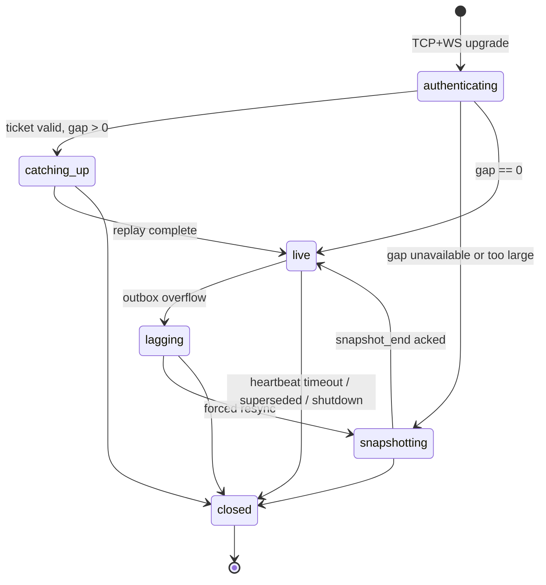

# WebSocket 生命周期与实时同步

## 1. 目的

`REQ-BACKEND-003`：定义 WebSocket 连接的 Ticket 握手、帧格式、心跳、ack、断线重连、Revision catch-up 与 Snapshot fallback，保证 Client 权威投影与服务器已提交 Revision 收敛一致且 DomainEvent 不丢失。

## 2. 非目标

本文不定义 Command/Event 的 payload 语义（`DOC-BACKEND-005..006`）、Origin/Session/权限模型（`DOC-BACKEND-008`）、Outbox 与队列容量的进程级配置（`DOC-BACKEND-001`）、Snapshot 的持久化格式（`DOC-RELEASE-003`）。不支持多机或多人同时连接同一世界的协作语义。

## 3. 术语与定义

| 术语 | 定义 |
|---|---|
| WebSocket Ticket | REST 颁发的单次、短时、绑定 Session 与 world 的握手凭据 |
| Session Channel | 一条已认证 WebSocket 连接及其服务器侧 Outbox sender |
| Heartbeat | 应用层保活帧对，基于 monotonic RealTime 判定超时 |
| Ack Revision | Client 已确认持久应用的最大连续 Revision |
| Catch-up | 重连后按 Revision 区间从 Event Log 补发不可丢事件 |
| Snapshot Fallback | 增量不可用或过大时改发全量权威投影 |
| Lagging Session | 消费速度落后、被强制进入 Snapshot resync 的连接 |

## 4. 规则与不变量

- `RULE-BACKEND-012`：WebSocket 握手必须携带经 `POST /api/v1/ws-tickets` 颁发的 Ticket；Ticket 绑定 `(session_id, world_id)`、TTL 30000 real ms、单次使用，重放或过期一律拒绝。握手检查顺序固定：Origin/Host → Ticket 有效性 → Session 状态。
- `RULE-BACKEND-013`：同一 Session 对同一 world 最多一条 live 连接；新连接完成 hello 后，旧连接以 `BACKEND_WS_SUPERSEDED` 关闭，Outbox 游标移交给新连接。
- `RULE-BACKEND-014`：服务器每 20000 real ms 发送 `heartbeat` 帧，Client 须在 5000 real ms 内回 `heartbeat_ack`；连续 2 次未回则服务器关闭连接。Client 侧对称检测。全部使用 monotonic RealTime，GameTime pause 不豁免心跳。
- `RULE-BACKEND-015`：事件帧按 Revision 严格递增推送，不重排、不跳号；Client 周期性发送 `ack` 帧携带 `last_acked_revision`，Outbox 只释放已 ack 的不可丢事件缓冲。
- `RULE-BACKEND-016`：重连 hello 携带 `last_acked_revision`；服务器从 Event Log 补发 `(last_acked_revision, current_revision]` 内全部不可丢 DomainEvent。区间不可用（已裁剪）或长度超过 `catch_up_max_events`（默认 5000）时必须 Snapshot fallback；禁止静默跳过任何 DomainEvent。
- `RULE-BACKEND-017`：Outbox 达到容量（`ws_outbox_capacity`，默认 512）时先合并 `coalescible=true` 的 render delta；不可丢 DomainEvent 仍超容量时将连接标记 Lagging、丢弃其增量缓冲并强制 Snapshot resync。任何路径都不得丢弃 DomainEvent 本体（Event Log 仍完整）。
- `RULE-BACKEND-018`：所有帧携带 `protocol_version`；未知 `frame_type`、非法 JSON 或版本不匹配时发送 `error` 帧（`BACKEND_PROTOCOL_MISMATCH`）并关闭连接，不猜测语义、不部分执行。

## 5. 数据与接口

`DES-BACKEND-003`：Ticket 响应与帧 envelope。

Ticket（REST 响应 data，字段策略见 `DOC-BACKEND-012` 脱敏表：`ticket` 值本身 never-log）：

```json
{
  "schema_version": 1,
  "ticket": "b64u_9f2c1d7e8a4b5c6d7e8f9a0b1c2d3e4f",
  "world_id": "01K1AB2CD3EF4GH5JK6MNP7QRS",
  "expires_at_utc": "2026-07-26T08:30:45.250Z",
  "single_use": true
}
```

`expires_at_utc` 为 UTC RFC 3339 墙钟（`RULE-FOUNDATION-044`），仅供 Client 展示与提前重申请参考；Ticket TTL 的权威判定按 `RULE-BACKEND-012` 在服务器侧以 monotonic RealTime 计量（`RULE-FOUNDATION-035`）。

帧 envelope（`payload` 结构由 `frame_type` 决定）：

```json
{
  "protocol_version": 1,
  "frame_type": "event",
  "frame_id": "01K1AB2CD3EF4GH5JK6MNP7QRT",
  "payload": {}
}
```

帧类型注册表：

| frame_type | 方向 | payload |
|---|---|---|
| `hello` | C→S | `{schema_version, ticket, last_acked_revision, client_protocol_version}` |
| `hello_ack` | S→C | `{schema_version, world_id, current_revision, resume_mode}`，`resume_mode` ∈ `live/catch_up/snapshot` |
| `heartbeat` / `heartbeat_ack` | S→C / C→S | `{schema_version, heartbeat_id}`；`heartbeat_ack` 原样回显收到的 `heartbeat_id`（ULID），往返耗时与超时由发送方以本端 monotonic RealTime 计量（`RULE-FOUNDATION-035`），wire 上不传输任何时钟读数 |
| `command` | C→S | Command Envelope（`DOC-BACKEND-005`） |
| `command_receipt` | S→C | CommandReceipt（`DOC-BACKEND-005`） |
| `event` | S→C | Event Envelope（`DOC-BACKEND-006`） |
| `snapshot_begin` / `snapshot_chunk` / `snapshot_end` | S→C | 锚定单一 Revision 的分块权威投影 |
| `ack` | C→S | `{schema_version, last_acked_revision}` |
| `error` | S→C | 错误对象（`DOC-BACKEND-011`） |

连接状态机：



## 6. 正常流程

1. Client 经 REST 获取 Ticket，随即发起 `ws://127.0.0.1:{port}/ws/v1` 升级并发送 `hello`。
2. 服务器按 `RULE-BACKEND-012` 验证，标记 Ticket 已用，回 `hello_ack` 并声明 `resume_mode`。
3. `catch_up`：按 Revision 顺序补发区间事件，补完后进入 live；`snapshot`：分块发送锚定 Revision 的投影，`snapshot_end` 后进入 live。
4. live 阶段：Outbox sender 顺序推送已提交事件与合并后的 render delta；Client 周期 ack；双向心跳保活。
5. 正常关闭：服务器 Graceful Drain 时发送 `error(BACKEND_SHUTDOWN)` 后关闭；Client 主动关闭无需通知语义。

## 7. 边界情况

- Ticket 颁发后未在 TTL 内使用：握手拒绝，Client 重新申请；Ticket 不可续期。
- hello 的 `last_acked_revision` 大于服务器当前 Revision：视为损坏或跨世界错连，拒绝并要求 Snapshot 重建，不采信 Client 声称的进度。
- catch-up 过程中产生新提交：新事件顺延在补发流之后，仍保持 Revision 全序，不并行双流。
- 心跳超时但 TCP 未断：服务器主动关闭并保留 Outbox 游标 60000 real ms 供快速重连；超时后重连按 Event Log catch-up。
- 世界切换：旧世界连接必须关闭并重新走 Ticket 握手；一条连接不复用于多个 world。
- Client 收到重复 `event_id`（补发重叠）：按 `RULE-BACKEND-035` 幂等丢弃，不二次应用。

## 8. 错误与降级

握手失败（Origin、Ticket、Session）返回明确 close code 与 `error` 帧后关闭，不进入半认证状态。Event Log 读取失败时降级为 Snapshot fallback；Snapshot 也失败则关闭连接并向 `DOC-BACKEND-011` 的存储失败路径上报。Lagging 循环出现 3 次以上时保持 Snapshot 模式并提示 Client 降低渲染消费频率，服务器不无界缓冲。

## 9. 安全与性能

Ticket 为 256-bit CSPRNG 值，日志只记录其 SHA-256 前 12 hex 字符指纹；帧大小上限与速率限制由 `DOC-BACKEND-008` 定义。Outbox 发送在独立协程执行，不占用 Tick critical section（`RULE-BACKEND-005`）；render delta 合并策略保证每连接每 100 real ms 至多一次位置批量帧。心跳与 catch-up 参数为只读配置，运行时不可变。

## 10. 验收标准

- Ticket 重放、过期、跨 Session 使用全部被拒绝且留下审计日志。
- 断线于任意 Revision 后重连，Client 投影与服务器状态逐字段一致，DomainEvent 无丢失、无重复应用。
- 增量超过 `catch_up_max_events` 或 Event Log 裁剪时自动 Snapshot fallback 且结果一致。
- Outbox 压力注入下 render delta 被合并、DomainEvent 全量送达或触发显式 resync。
- 心跳超时、supersede、shutdown 三类关闭均产生确定的 close 语义，无悬挂连接。

## 11. 测试追踪

| 测试 ID | 断言 |
|---|---|
| `TEST-BACKEND-009` | `RULE-BACKEND-012..013` Ticket 单次性、TTL、supersede |
| `TEST-BACKEND-010` | `RULE-BACKEND-014..015` 心跳超时与 ack 顺序 |
| `TEST-BACKEND-011` | `RULE-BACKEND-016` catch-up 区间完整性与 Snapshot fallback 一致性 |
| `TEST-BACKEND-012` | `RULE-BACKEND-017..018` 溢出合并、Lagging resync 与协议错误关闭 |

## 12. 关联文档

- `DOC-BACKEND-001`：Outbox 容量与队列隔离
- `DOC-BACKEND-005..006`：command/event 帧 payload 语义
- `DOC-BACKEND-008`：Origin、Session 与速率限制
- `DOC-BACKEND-011`：错误码与关闭语义
- `DOC-RELEASE-003`：Event Log 与 Snapshot 持久化
