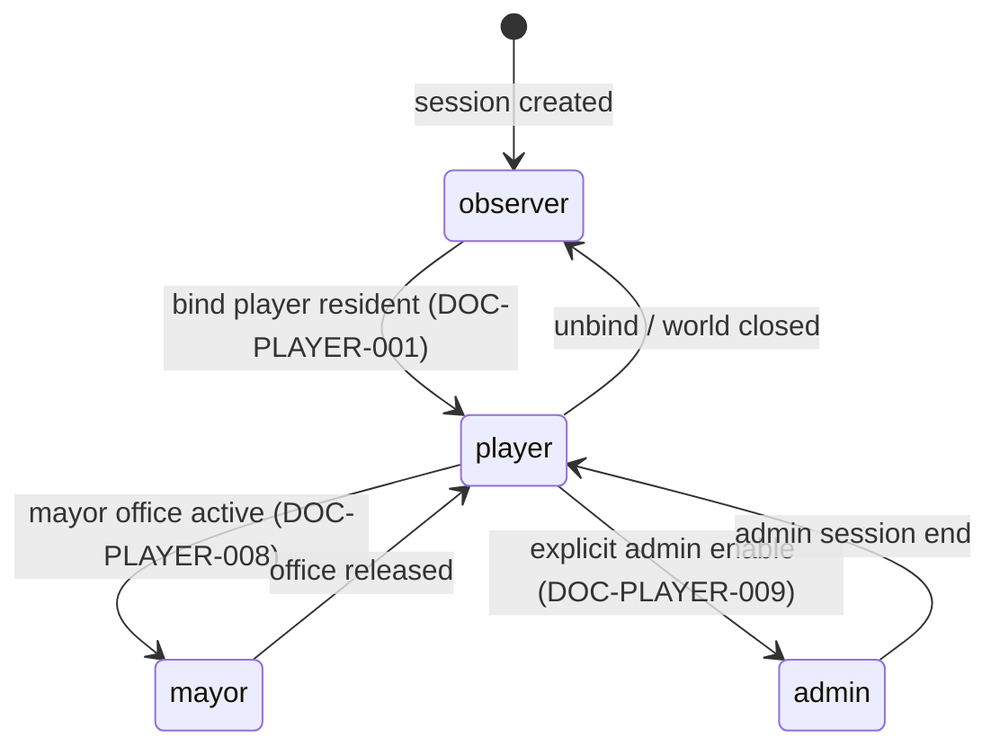

# 本地 Session 与权限执行

## 1. 目的

`REQ-BACKEND-008`：定义本地单用户场景下的 Session 建立、Cookie 属性、Origin/Host 校验、CSRF 双重防护、CORS 拒绝策略、速率与 body 限制，以及角色权限的后端执行点，抵御「本机其他页面/进程调用本地 API」这一主要威胁。

## 2. 非目标

本文不定义多用户账号体系、远程认证或 TLS（本产品只服务 loopback HTTP）；不定义 player/mayor/admin 的权限矩阵内容（`DOC-PLAYER-007..009` 是 canonical owner，本文只定义执行点）；不定义 Secret 存储（`DOC-BACKEND-009`）；不定义进程绑定策略（`RULE-BACKEND-001`）。

## 3. 术语与定义

| 术语 | 定义 |
|---|---|
| Session Secret | 进程启动时 CSPRNG 生成的 256-bit 内存密钥，用于签发 Session |
| Session Cookie | `ai_town_session`，HttpOnly + SameSite=Strict 的会话凭据 |
| CSRF Token | 双提交防护中的非 HttpOnly Cookie 与自定义头对 |
| Origin Allowlist | 唯一合法来源集合：本进程端口上的 loopback 源 |
| Role State | Session 当前角色：`observer/player/mayor/admin` |
| Route Class Limit | 按端点类别配置的 token bucket 速率限制 |

## 4. 规则与不变量

- `RULE-BACKEND-042`：Session 由 `POST /api/v1/session` 建立：颁发 `ai_town_session` Cookie，属性固定 `HttpOnly; SameSite=Strict; Path=/`（loopback HTTP 不设 Secure）；值为 Session Secret 签名的不透明令牌。Session Secret 仅存内存、每次进程启动重新生成，进程重启使全部旧 Session 失效并由前端静默重建。
- `RULE-BACKEND-043`：Origin/Host 校验：`Host` 必须为 `127.0.0.1:{port}` 或 `localhost:{port}`；所有非 GET REST 与 WS 握手的 `Origin` 必须命中同一 Allowlist。非 GET 请求缺失 Origin 或不匹配一律 `BACKEND_ORIGIN_REJECTED`（403）；GET 静态资源与 health 允许无 Origin（浏览器直航）。
- `RULE-BACKEND-044`：CORS 全拒绝：任何响应不携带 `Access-Control-Allow-*` 头；`OPTIONS` preflight 一律 403。同源架构下出现跨源请求即视为攻击面探测并计入审计日志。
- `RULE-BACKEND-045`：CSRF 双提交：Session 建立时同时颁发非 HttpOnly 的 `ai_town_csrf` Cookie；所有非 GET REST 必须携带 `X-AI-Town-Csrf` 头且与 Cookie 值一致，否则 `BACKEND_CSRF_REJECTED`（403）。WS 命令通道由单次 Ticket（`RULE-BACKEND-012`）等效防护，不重复要求该头。
- `RULE-BACKEND-046`：权限执行点唯一在后端：命令 `type` 前缀与 Role State 的映射按 `DOC-PLAYER-007..009` 的权限矩阵执行，Gateway 在 `RULE-BACKEND-022`/`DES-BACKEND-005` 的顺序位点检查；失败返回 `BACKEND_FORBIDDEN` 并审计（admin 全量审计按 `DOC-PLAYER-009`）。BACKEND 不自定义权限内容，Client UI 的显示/隐藏不构成权限。
- `RULE-BACKEND-047`：Route Class 速率限制（token bucket，按 Session 计）：`secret` 5/min、`destructive` 5/min、`world-admin` 30/min、`save` 12/min、`ticket` 10/min、`diagnostics` 2/min、`settings` 30/min、`session` 10/min、`health` 120/min；WS `command` 帧 20/s（burst 40）、`ack/heartbeat_ack` 10/s。超限 `BACKEND_RATE_LIMITED` 且携带 `retry_after_ms`。
- `RULE-BACKEND-048`：输入尺寸限制：REST body ≤ 65536 bytes（`max_body_bytes`）、WS 单帧 ≤ 32768 bytes、JSON 嵌套深度 ≤ 32、数组长度与字符串长度按各 Schema 上限；超限立即拒绝（`BACKEND_BODY_TOO_LARGE`），不做部分解析。服务器出站 Snapshot 分块不受入站帧限制约束，但单块 ≤ 262144 bytes。

## 5. 数据与接口

`DES-BACKEND-008`：`SessionInfoV1`（Cookie 值本身 never-log，见 `DOC-BACKEND-012` 脱敏表）：

```json
{
  "schema_version": 1,
  "session_id": "01K1AB2CD3EF4GH5JK6MNP7QS2",
  "role_state": "player",
  "world_id": "01K1AB2CD3EF4GH5JK6MNP7QRS",
  "expires_at_real_time_ms": 1785056400000,
  "csrf_rotation_at_real_time_ms": 1785054600000
}
```

Role State 状态机（迁移条件的 canonical 定义在 PLAYER 域）：



检查与执行位点汇总：

| 防线 | 位点 | 失败码 |
|---|---|---|
| Host 校验 | transport 之后第一层 | `BACKEND_ORIGIN_REJECTED` |
| Origin 校验 | 同上（非 GET 与 WS） | `BACKEND_ORIGIN_REJECTED` |
| 速率限制 | Origin 之后 | `BACKEND_RATE_LIMITED` |
| body/帧尺寸 | 解析前 | `BACKEND_BODY_TOO_LARGE` |
| Session 验签 | 解析后 | `BACKEND_SESSION_INVALID` |
| CSRF 头 | Session 之后（非 GET REST） | `BACKEND_CSRF_REJECTED` |
| 角色权限 | 路由/命令分发时 | `BACKEND_FORBIDDEN` |

## 6. 正常流程

1. 浏览器加载同源静态页面，前端调用 `POST /api/v1/session` 获得 Session 与 CSRF Cookie。
2. 之后每个非 GET REST 请求由前端统一注入 `X-AI-Town-Csrf` 头。
3. 打开世界并绑定玩家居民后 Role State 变为 `player`；mayor/admin 迁移按 PLAYER 域流程。
4. 每个入站请求按 §5 位点表顺序检查，全部通过才进入用例/命令管线。
5. Session 空闲 60 real 分钟过期；前端捕获 `BACKEND_SESSION_INVALID` 后静默重建 Session 并重试一次幂等请求。

## 7. 边界情况

- 本机恶意网页 `http://evil.example` 携带用户浏览器发起请求：SameSite=Strict 阻止 Cookie 附带；即使浏览器旧版本泄漏 Cookie，Origin 校验与 CSRF 头仍分别拦截；三层独立防线。
- 本机非浏览器进程直接 curl loopback：无有效 Session 签名即 `BACKEND_SESSION_INVALID`；本产品不声称防御同用户本机进程的全部能力（该进程也可直接读用户文件），只保证不被静默滥用且留下审计日志。
- `localhost` 解析为 IPv6 `::1`：绑定仍为 `127.0.0.1`（`RULE-BACKEND-001`），前端统一使用启动器打开的确切源；`::1` 连接失败属预期。
- 多标签页同时打开：共享 Session 与 CSRF Cookie；WS 每标签独立 Ticket，world 连接唯一性由 `RULE-BACKEND-013` 处理。
- 系统休眠恢复后 Session 过期：与空闲过期同路径，静默重建；Role State 从服务器状态恢复，不从 Client 缓存恢复。

## 8. 错误与降级

安全类拒绝（Origin/CSRF/Session/权限）响应体只含错误码与通用 message，不解释具体判定细节以免辅助探测；连续 10 次安全拒绝后对该连接/Session 施加 5000 real ms 退避。速率限制器故障时 fail closed 到保守全局限额，不放开为无限。

## 9. 安全与性能

审计日志记录安全拒绝的：时间、位点、路径、脱敏 Origin、`session_id`（可记录）、结果码；不记录 Cookie 值、CSRF 值、Ticket 值。全部校验为内存操作，位点表整体开销目标 < 1 ms/请求。安全响应头基线由 `RULE-BACKEND-001` 所在文档 §9 定义（nosniff、CSP、Referrer-Policy）。

## 10. 验收标准

- 安全 fixture（`DOC-BACKEND-012`）中伪造 Origin、缺失 CSRF、过期 Session、越权命令、超限速率、超大 body 六类全部被对应位点拒绝且无副作用。
- 三层防线独立性测试：任意关闭其一（测试构建）其余仍拦截 CSRF 场景。
- 进程重启后旧 Session/CSRF/Ticket 全部失效，前端在 2 次请求内自动恢复。
- preflight 与跨源请求零通过、全审计。
- 权限矩阵一致性：BACKEND 执行结果与 `DOC-PLAYER-007..009` 声明逐条对照通过。

## 11. 测试追踪

| 测试 ID | 断言 |
|---|---|
| `TEST-BACKEND-028` | `RULE-BACKEND-042` Session 生命周期与重启失效 |
| `TEST-BACKEND-029` | `RULE-BACKEND-043..045` Origin/CORS/CSRF 三层拦截 |
| `TEST-BACKEND-030` | `RULE-BACKEND-046` 角色执行点与 PLAYER 矩阵一致性 |
| `TEST-BACKEND-031` | `RULE-BACKEND-047..048` 速率与尺寸限制边界值 |

## 12. 关联文档

- `DOC-BACKEND-001`：loopback 绑定与安全响应头
- `DOC-BACKEND-003`：WS Ticket 等效防护
- `DOC-BACKEND-009`：Secret 提交通道复用本文防线
- `DOC-BACKEND-011`：安全错误码注册
- `DOC-PLAYER-007..009`：角色权限矩阵 canonical owner
