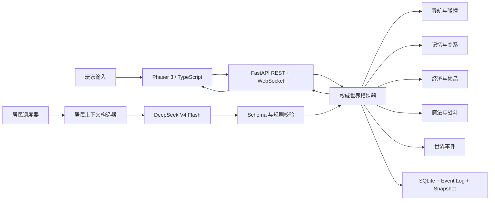

# AI 小镇总体系统设计

- 状态：已完成对话评审，等待书面规格最终确认
- 日期：2026-07-26
- 目标平台：Windows 10/11
- 运行形态：本地 FastAPI 权威服务器 + Phaser 3 浏览器客户端
- AI 模型：`deepseek-v4-flash`

## 1. 目标与成功标准

本项目交付一个中世纪剑与魔法、日式西幻手绘绘本风格的单机 AI 小镇。玩家可作为真实居民进入世界，也可切换到镇长模式治理小镇。首版包含 8–12 名 AI 居民、小镇、森林、矿洞、独立室内场景、动态建筑、经济、魔法、回合制 JRPG 战斗、世界事件、多世界存档和自包含 Windows 发布包。

成功标准：

1. 双击 `启动AI小镇.bat` 后自动启动本地服务并打开浏览器，普通玩家无需安装 Python 或 Node.js。
2. 首次进入明确提示 `F11` 和界面全屏按钮。
3. 玩家与 AI 居民只能在合法区域行动，房屋、树木、悬崖、水域和封锁区不可穿越。
4. AI 居民自主决定目标、对象、行动类型、参数和表达内容；后端验证规则并提交世界变化。
5. 玩家在居民模式中可移动、交谈、工作、交易、施法、战斗、建立关系并影响事件。
6. 玩家可切换镇长模式，执行受规则和预算约束的治理操作。
7. DeepSeek 超时、空响应、非法 JSON 或不可用时，世界仍能通过本地 Utility AI 安全运行。
8. 世界关闭后暂停；重新打开后从一致性存档恢复。
9. 正式居民首版不会永久死亡，但会受伤、生病、昏迷、负债、被俘或承受长期社会后果。
10. 完整发布前必须通过规则测试、AI 行为评估、长时间模拟、真实浏览器视觉 QA 和新 Windows 环境双击启动验收。

## 2. 范围

### 2.1 首版包含

- Windows 10/11 单机运行
- 8–12 名核心 AI 居民
- 玩家居民模式与镇长模式
- `Sandbox Admin` 可选管理辅助
- 王冠溪镇、暮语森林、银烬矿洞
- 独立室内场景
- 五层地图结构
- 动态建筑、损坏、修复和施工
- DeepSeek V4 Flash 三层认知周期
- 记忆、关系、谣言、秘密和承诺
- 时间、天气、职业、经济和物品
- 魔法与回合制 JRPG 战斗
- AI Event Director、任务和长期世界变化
- 自动存档、三个手动槽位、多世界和恢复
- 本地日志、诊断和发布包

### 2.2 首版不包含

- 局域网或公网多人
- 手机适配
- 云存档
- 语音输入
- 正式居民永久死亡
- AI 创建新的可执行 Action 类型
- 每次新游戏重新生成整张地图
- Mod SDK
- Steam 或应用商店发布
- 公网后端
- 自动切换其他模型供应商
- 展示或存储原始 Chain of Thought

## 3. 关键设计原则

1. 后端是唯一权威世界状态来源。
2. DeepSeek 只能提出结构化行动意图，不能直接修改世界。
3. 前端只提交玩家命令并渲染已批准事件。
4. 视觉图片与规则数据分离，不能从图片像素猜测通行性。
5. 客观事实、居民信念和居民记忆严格分离。
6. 金钱、物品、位置、关系、战斗和建筑变化必须有可追踪 Domain Event。
7. 长任务、AI 请求、存档和 WebSocket 队列相互隔离，不能阻塞 World Tick。
8. 所有破坏性管理行为具有权限、二次确认和审计记录。
9. 规则随机数由世界 Seed 提供；模型响应通过记录进行重放。
10. 文档、代码和测试使用稳定 ID 建立追踪关系。

## 4. 总体架构



后端模块边界：

```text
app/
├─ api/
├─ bootstrap/
├─ world/
├─ residents/
├─ ai/
├─ memory/
├─ social/
├─ navigation/
├─ economy/
├─ magic/
├─ combat/
├─ events/
├─ persistence/
├─ security/
└─ diagnostics/
```

Domain 模块不依赖 Phaser，不直接执行 SQLite 语句，也不直接绑定某一家模型 SDK。数据库通过 Repository 访问，模型通过 `ModelProvider` 访问。

## 5. 权威状态与数据流

一次 AI 行动按照以下顺序处理：

```text
观察居民可知世界
→ 检索相关记忆与关系
→ 生成 Daily Plan / Hourly Intent / Immediate Action
→ DeepSeek 返回结构化 ActionProposal
→ JSON Schema 与权限校验
→ 目标、距离、资源、冷却、社会、战斗和导航校验
→ 必要的资源 Reservation
→ SQLite 事务提交状态与 Domain Event
→ WebSocket 发送渲染事件
→ Phaser 播放路径和动画
→ 写入结果记忆和后续调度
```

模型无法直接指定可信 `actor_id`、世界 Revision、伤害数值、交易结果或穿墙路径。后端提交成功才代表行动成功，前端动画结束不构成规则事实。

## 6. 地图、空间与导航

### 6.1 区域

- 王冠溪镇：约 `4096 × 4096` world units
- 暮语森林：约 `4096 × 4096` world units
- 银烬矿洞：约 `3072 × 3072` world units
- 室内：使用独立局部坐标和入口节点

三个主要区域使用明确的 Semantic Exit 成对连接。区域切换由后端检查目标入口、权限和目标站立点。

### 6.2 五层地图

1. `Ground Art`：由图像生成工具生成的无角色、无 UI、无可拆建筑地表。
2. `Structure`：房屋、桥、树木、矿石等独立对象。
3. `Walkability`：道路、广场、室内地板等合法站立区。
4. `Collision`：墙体、树干、悬崖、水域和废墟 Polygon。
5. `Semantic`：门、柜台、床、工作台、矿点和战斗触发区。

图像只负责外观，结构化数据负责规则。任何角色都不能从图像颜色推断能否通行。

### 6.3 动态建筑

建筑绑定：

- Footprint Polygon
- Collision Polygon
- Entrance Node
- Interior Scene
- Construction Stage
- Damage State
- Navigation Modifier
- Semantic Nodes

建筑至少具有地基、施工中、完整、轻度受损、严重受损和废墟状态。建造、损坏和修复必须原子更新 Collision 与 Navigation。放置建筑前必须验证不会切断必要通路。

## 7. 美术、渲染、UI 与音频

### 7.1 风格

采用中世纪剑与魔法的日式西幻手绘绘本方向。地图为视觉主角，羊皮纸、深木和旧黄铜仅作为克制的信息容器。不得模仿特定在世艺术家。

地图生成要求：

- 正交俯视
- 道路边缘清晰
- 无角色、文字、标签和 UI
- 可拆建筑不画入 Ground Art
- 三个区域共享比例、光照和色板

### 7.2 角色

8–12 名核心居民各自拥有设定图、对话立绘、表情、Overworld Sprite、战斗 Sprite 和头像。首版采用四方向行走，每方向 6 帧；Idle 每方向 2–4 帧，并提供受伤、交互、施法、攻击和倒地动画。

### 7.3 UI

- 左上：玩家身份、HP 和 MP
- 右上：日期、时间、天气和倍率
- 右侧：附近居民的公开简要信息
- 底部：当前可用按键
- 对话：立绘、情绪提示和自然语言输入
- 镇长模式：左侧导航、中央地图、右侧检查器

设计基准为 `1920 × 1080`，最低支持 `1280 × 720`。支持响应式缩放、按键重绑定、`F11` 和需要用户点击的 Fullscreen API。

### 7.4 音频

小镇、森林、矿洞和室内拥有独立环境声。音乐根据昼夜、天气、区域、危险度、战斗和重大事件分层切换。所有资源必须记录来源与许可证，优先原创、合法生成或 CC0。

## 8. 居民与 AI 决策

### 8.1 居民

Resident 模型包含身份、种族、外貌、性格、价值观、Needs、情绪、健康、技能、职业、住所、Inventory、关系、记忆和承诺。正式居民首版不会永久死亡。

### 8.2 三层认知周期

1. `Daily Plan`：每日目标、工作、社交、资源需求和风险应对；默认 Thinking Mode。
2. `Hourly Intent`：当前意图、目标、候选序列、预计时间和放弃条件。
3. `Immediate Action`：一次可执行动作。

首版 Action Catalog 至少包含：

```text
move_to, talk, work, rest, eat, buy, sell, give_item,
use_object, craft, gather, explore, cast_spell,
start_encounter, combat_action, build, repair, wait, observe
```

所有有意图的居民行动由 DeepSeek 决定。逐帧移动、动画衔接、数值结算和路径计算是确定性机械执行。模型失败时才使用 Utility AI 维持基本生活和安全。

### 8.3 ActionProposal

```json
{
  "goal": "在闭店前购买治疗药水",
  "action": "buy",
  "target_entity_id": "resident.apothecary.elise",
  "destination_id": "shop.apothecary.counter",
  "parameters": {
    "item_id": "item.healing_potion.small",
    "quantity": 2,
    "maximum_unit_price": 18
  },
  "spoken_text": "晚上好，我想买两瓶小型治疗药水。",
  "emotion": "anxious",
  "priority": 72,
  "expected_duration_minutes": 5,
  "abort_conditions": ["shop_closed", "insufficient_funds", "target_unavailable"]
}
```

服务器添加 Proposal ID、Actor ID、World ID、Revision、时间、Prompt/Model 版本和 Token 统计。

错误分为：

- `REPAIRABLE`：允许白名单式参数修正。
- `REPLAN_REQUIRED`：世界状态变化，要求 AI 重新规划。
- `FORBIDDEN`：越权或非法能力，拒绝并审计。

## 9. DeepSeek 接入

当前接口配置：

```text
Base URL: https://api.deepseek.com
Model: deepseek-v4-flash
```

普通即时行动显式关闭 Thinking Mode；Daily Plan、重大事件和复杂冲突显式开启，复杂规划使用 `reasoning_effort=high`。首版以稳定 JSON Output 和 Pydantic 校验为主，不把正确性建立在 Beta strict Tool Calls 上。

`reasoning_content` 不展示、不写入居民记忆、不进入普通日志。模型空响应、非法 JSON、Schema 错误、超时和限流分别有受限重试与 Utility AI 降级，不能无限重试。

Prompt 使用版本化 ID，例如：

```text
resident-daily-plan/v1
resident-hourly-intent/v1
resident-action/v1
resident-dialogue/v1
resident-combat-turn/v1
event-director/v1
memory-consolidation/v1
```

参考：

- [DeepSeek Models & Pricing](https://api-docs.deepseek.com/quick_start/pricing)
- [Thinking Mode](https://api-docs.deepseek.com/guides/thinking_mode)
- [JSON Output](https://api-docs.deepseek.com/guides/json_mode/)
- [Tool Calls](https://api-docs.deepseek.com/guides/tool_calls)

## 10. 记忆、关系、谣言与秘密

认知数据分为：

- `EpisodicMemory`
- `SemanticBelief`
- `SocialImpression`
- `Commitment`
- `RoutineKnowledge`

记忆检索综合语义相关度、当前目标、参与者关系、情绪、重要性、承诺、最近程度和时间衰减。低重要度重复事件合并为摘要，高重要度创伤、救命之恩、重大背叛和长期承诺不会自动遗忘。

关系采用五个独立的 `-100..100` 维度：

- `affection`
- `trust`
- `fear`
- `respect`
- `intimacy`

关系变化必须由已提交事件触发，并结合居民性格和主观解释计算。

谣言使用带来源链的 `BeliefTransfer`，记录原始事件、讲述者、来源、传播链、摘要、可信度和失真。居民不会自动知道谣言真假。

秘密访问级别：

```text
public, community, faction, relationship, personal, shared_secret
```

访问控制在后端上下文构造器执行。模型不会收到当前居民无权知道的秘密。

## 11. 时间、调度与并发

三套时间：

- `RealTime`：超时、动画和性能
- `GameTime`：世界运行
- `TurnTime`：回合制战斗

默认现实 1 秒等于游戏 1 分钟，支持 `0×`、`0.5×`、`1×`、`2×` 和 `4×`。前端通常 60 FPS，后端 World Tick 为 10 Hz，周期业务使用事件队列。

居民模拟层级：

- `Active`：玩家所在区域，完整路径和碰撞。
- `Warm`：其他加载区域，语义路径和分钟级进度。
- `Background`：未加载区域或长任务，按开始、结束和条件模拟。

AI 请求携带不可变 Decision Context、World Revision 和 GameTime。返回后必须用最新世界重新校验。默认最多两个普通居民模型请求并发，玩家对话、战斗和紧急危险优先。

输入自然语言、镇长管理和回合制战斗时默认暂停 Overworld。高倍速下提前生成计划，队列过载时自动降低倍率。

关闭游戏后世界暂停，不根据现实离线时间推进。

## 12. 玩家与镇长

居民模式：

```text
WASD  移动
Shift 快走
E     交互
Enter 自然语言对话
I     物品栏
J     日志与承诺
M     地图
Tab   居民/镇长模式
Esc   暂停
F11   全屏
```

玩家与 AI 居民使用同一碰撞、经济、技能、战斗、健康、权限和社会规则。区别仅在决策来源：玩家通过输入生成 `PlayerCommand`，AI 生成 `ActionProposal`。

镇长模式是世界内治理身份，可处理公共建筑、预算、工资、税率、公告、道路、节日、灾害和公共统计。镇长不能读取私人记忆、强制改变感情、凭空创造私人财产或直接指定战斗胜负。

可选 `Sandbox Admin` 用于调试和自由体验，具有二次确认、独立 `AdminCommand`、审计日志和永久存档标记。

## 13. 对话

对话前检查距离、视线、居民状态和语言条件。输入框默认暂停世界。玩家自然语言形成 `PlayerSpeechCommand`，居民基于自身记忆、关系、情绪、秘密权限和世界知识响应。

居民可拒绝、隐瞒、撒谎、协商、记住承诺或中断对话。玩家文本不能让居民绕过物品、经济、魔法、关系或管理权限。所有模型文本按纯文本渲染，不能作为 HTML 执行。

## 14. 经济、职业与物品

三个区域形成生产链：

```text
森林 → 木材、草药、食材
矿洞 → 矿石、魔晶、石料
生产建筑 → 工具、武器、药水、食物、魔法物品、建筑材料
```

货币使用整数最小单位：`1 银冠 = 100 铜羽`。交易必须在一个事务中完成付款、收款、税费和所有权转移。

物品分为 `stackable`、`unique`、`container`、`property_deed` 和 `magical`。唯一物品只能有一个所有者，Inventory 具有格子、重量、类型和权限限制。

首版职业包括铁匠、药剂师、酒馆老板、商人、镇卫、矿工、采集者、木匠、法师、治疗者和冒险者。居民可转职或停工。

价格由基准价、库存、近期需求、地区事件、利润率和关系折扣计算，并设置上下限。居民只能依据自身见过的信息决策。

建筑施工必须消耗土地权、材料、工具、劳动力、工期和审批，分为规划、清理、地基、主体、设施和验收阶段。

## 15. 魔法、战斗与健康

首版魔法流派：

- `Elemental`
- `Restoration`
- `Warding`
- `Illusion`
- `Spirit`
- `Arcane`

法术由注册 `SpellDefinition` 定义消耗、范围、目标、条件、效果、环境作用和法律状态。AI 只能选择已学会且合法可用的法术。

回合制 JRPG 战斗使用独立场景，Overworld 暂停。每方首版最多四名主要参战者，具有前排和后排。可用行动包括攻击、技能、法术、物品、防御、调整阵位、帮助、观察、交谈、逃跑和投降。

玩家手动决定自身回合。AI 角色每回合由 DeepSeek 从合法行动集合中选择；失败时使用 Tactical Utility AI。模型不决定伤害、命中和掉落数值。

玩家和正式居民 HP 归零后进入昏迷、重伤、被俘或撤退流程，不永久删除。普通魔物、召唤物和非居民敌人可以死亡或消散。

## 16. 事件、任务、天气与长期变化

区分：

- `DomainEvent`：原子事实
- `WorldEvent`：持续世界事件
- `Quest`：结构化目标

事件来源包括时间、状态、居民、玩家、环境、AI Director 和 Sandbox Admin。AI Director 只能选择注册 `EventTemplate` 并填写受限参数。

事件生命周期：

```text
Candidate → Scheduled → Active → Escalated/Resolved/Failed/Expired
→ Aftermath → Archived
```

世界具有 Narrative Pressure Budget：同一时间最多一个重大危机，重复灾害有冷却，允许平静日。

任务目标必须使用结构化类型，如到达、交付、交谈、制作、保护、调查、战斗、修复或维持条件。AI 居民可在玩家不参与时独立推进或失败。

天气包括晴、多云、雨、暴雨、雾、雷暴、雪或魔法寒潮、异常魔力天气。天气影响画面、出行、视野、火灾、采集、矿洞、魔法、经济、路径和事件。

道路、建筑和环境变化通过追加式 `WorldDiff` 持久化，恢复操作追加反向事件而不删除历史。

## 17. API 与协议

FastAPI 同源提供静态前端、REST 和 WebSocket。

REST 用于健康、启动、世界管理、存档、设置、API Key、WebSocket Ticket 和诊断。WebSocket 用于玩家命令、世界事件和实时同步。

Command Envelope 至少包含：

```text
protocol_version, command_id, world_id,
expected_revision, type, payload
```

Event Envelope 至少包含：

```text
protocol_version, event_id, world_id, revision,
type, game_time, causation_id, correlation_id,
payload, render
```

每个世界使用单调递增 Revision。交易、战斗、建造和管理命令采用严格 Revision；断线重连按 Revision 获取增量或 Snapshot。

同一个 Command ID 最多生效一次。Domain Event 不可丢弃；位置类渲染事件可合并。队列严重滞后时重新发送 Snapshot。

## 18. 本地安全

- 后端只绑定 `127.0.0.1`
- 同源静态前端与 API
- 随机 Session Secret
- SameSite Cookie
- Origin 和 Host 校验
- 单次 WebSocket Ticket
- 严格 CORS
- 请求体与速率限制
- 管理操作二次确认
- 静态路径规范化
- 禁止任意文件读取
- 禁止前端指定数据库路径
- 模型内容按纯文本处理

DeepSeek Key 通过同源 Session 提交，使用 Windows Credential Manager 或 DPAPI 按用户保护。Key 不进入 SQLite、配置文件、日志、浏览器存储和诊断包。

## 19. 存档、恢复与数据

程序与用户数据分离。用户数据位于 `%LOCALAPPDATA%\AI-Town`，每个世界拥有独立 `world.sqlite3`。

数据采用：

```text
规范化当前状态
+ 追加式 Domain Event Log
+ 周期性 Snapshot
```

SQLite 使用 WAL、Foreign Keys、Busy Timeout、单写入队列、只读查询连接和正常退出时的 `TRUNCATE` Checkpoint。

自动存档保留五个恢复点；每个世界提供三个手动槽位。读取旧槽位默认创建新时间线分支。世界可独立导入、导出、备份和删除。

启动恢复依次检查数据库、迁移、Snapshot、Event Log、Reservation、AI 请求和核心不变量。损坏恢复前必须复制原文件。

Migration 按版本逐步执行，迁移前备份，在事务中运行并完成完整性检查。失败时保留原数据库并停止世界模拟。

## 20. Windows 启动与发布

发布目录：

```text
AI-Town/
├─ 启动AI小镇.bat
├─ 停止AI小镇.bat
├─ runtime/
├─ assets/
├─ licenses/
└─ README-开始游戏.txt
```

前端在构建期生成静态资源。Python 后端采用 One-folder 自包含打包，不要求玩家安装开发环境。

Launcher 负责单实例、随机可用端口、健康检查、打开浏览器和系统托盘。托盘与网页均提供保存并退出。备用停止脚本用于托盘不可用场景。

发布必须验证中文路径、空格路径、端口占用、无开发环境新机器、依赖许可证和发布包内部代码版本。

## 21. 测试与可观测性

测试层级：

```text
Unit
→ Property
→ Contract
→ Integration
→ Simulation
→ Browser E2E
→ Visual QA
→ Packaged Release
```

核心不变量包括：

- 金币和物品守恒
- Inventory 不为负
- 唯一物品只有一个所有者
- 角色位置合法
- 路径不穿越 Collision
- 同一角色不参加两个战斗
- Revision 单调递增
- Command 最多生效一次
- 普通居民不能执行 AdminCommand
- 未授权秘密不能进入 Prompt
- 存档重载不改变 Seed

默认使用 `FakeModelProvider`，按输入 Hash 返回固定响应并模拟超时、空响应、非法 JSON 和越权。真实 DeepSeek 测试必须显式启用。

固定 AI 场景评估合法行动率、重规划率、Token、延迟、重复行为、人格一致性、秘密泄露和降级次数。

执行 1、7、30 游戏日模拟，检查内存、队列、经济、居民卡死、关系漂移、任务膨胀和存档增长。

浏览器 E2E 覆盖启动、创建世界、移动、碰撞、对话、室内、地图切换、镇长模式、建筑、战斗、存档、刷新恢复、全屏和退出。

默认不上传遥测。本地日志不得包含 API Key、Credential、原始 Chain of Thought、未脱敏 Prompt 或无关用户文件。

## 22. 文档工程

建立 15 个子系统，每个子系统 12 份文档，共 180 份；另有 8 份跨系统总纲，总计 188 份。

子系统：

1. 世界与游戏设计
2. 地图、空间与导航
3. 渲染、美术与音频
4. 居民与生命周期
5. AI 决策与模型编排
6. 记忆与社会关系
7. 时间、调度与世界模拟
8. 玩家与镇长模式
9. 对话与交流
10. 经济、职业与物品
11. 魔法系统
12. 回合制战斗与健康
13. 事件、任务、建筑与环境
14. 后端、API 与安全
15. 存档、启动与发布质量

每份文档必须具有目的、非目标、术语、数据、规则、不变量、正常流程、边界情况、错误与降级、接口、安全或性能约束、验收标准和测试编号。

文档开始生产后连续完成全部 188 份，中途不逐份请求用户审核。完成全量内容、一致性审计和可实现性审计后，再交由用户一次性验收。

全部文档验收前不编写游戏代码。正式地图和美术资源在文档 Gate 通过后生成。

## 23. 文档生产顺序

1. 8 份跨系统总纲与世界设计
2. 地图、空间、导航、渲染、美术和音频
3. 居民、AI、记忆和社会关系
4. 时间、调度、玩家、镇长和对话
5. 经济、物品、魔法、战斗和健康
6. 事件、任务、建筑、环境、后端、API 和安全
7. 存档、启动、发布、测试和全局追踪矩阵

全部文档完成后检查：

- 失效链接
- 重复 Rule ID
- 未定义术语
- Schema 字段冲突
- Event 或 Action 名称冲突
- 坐标与单位冲突
- 状态机不可达状态
- 无测试覆盖的 Must Requirement
- 不同文档中的默认值冲突
- 过期 DeepSeek 参数
- 范围外功能混入

## 24. Git 与旧目录保护

仓库必须忽略：

```gitignore
/old-dont-look*/
/.superpowers/
/data/
/logs/
*.sqlite3
*.sqlite3-wal
*.sqlite3-shm
.env
```

`old-dont-look*` 目录不读取、不递归扫描、不复制、不提交、不参与测试和打包，也不作为设计参考。

## 25. 阶段 Gate

| Gate | 通过条件 |
|---|---|
| G0 | 用户确认总体设计 |
| G1 | 本规格写入、复核并提交 |
| G2 | 实施计划写入并确认 |
| G3 | 188 份文档全部完成 |
| G4 | 文档一致性与可实现性审计通过 |
| G5 | 用户一次性确认完整文档体系 |
| G6 | 正式地图与美术资源完成 |
| G7 | 核心世界模拟通过测试 |
| G8 | AI、玩家和前端完整联通 |
| G9 | Windows 发布包通过真实双击验收 |

任何 Gate 未通过，不宣称后续阶段完成。

## 26. 主要风险与控制

| 风险 | 控制 |
|---|---|
| 生成底图无法支持动态建筑 | 地表、结构、规则和语义分层 |
| AI 输出非法行动 | Schema、权限、语义、资源和路径多重校验 |
| 188 份文档互相矛盾 | Canonical Source、稳定 ID、引用和全量审计 |
| 模型延迟拖慢世界 | 异步请求、分层计划、并发队列和 Utility AI |
| 高倍速超过模型供给 | 预取、候选序列、队列阈值和倍率回落 |
| 交易或战斗重复执行 | Revision、Idempotency、事务和 Event Log |
| 本机 API 被其他页面调用 | 回环绑定、同源、Session、Origin 和单次 Ticket |
| API Key 泄露 | Windows Secret、日志脱敏和诊断过滤 |
| 存档损坏 | WAL、Snapshot、Event Log、备份和恢复链 |
| 发布包不是最新代码 | 新机器端到端启动和包内版本验证 |
| 黑暗内容与非永久死亡冲突 | 以伤病、俘虏、诅咒、背叛和长期后果表现 |

## 27. 总体验收

只有满足以下条件，首版才可称为完成：

1. 188 份文档已一次性验收。
2. 三个区域完成五层地图与真实碰撞验证。
3. 玩家和 AI 居民使用相同世界规则。
4. 每个 AI 意图均有结构化提案、批准、拒绝或降级记录。
5. 记忆、关系、谣言和秘密遵守主观知识边界。
6. 经济、魔法、战斗、建筑和事件可跨存档持续。
7. 30 游戏日模拟无核心不变量破坏。
8. DeepSeek 不可用时世界仍可操作。
9. API Key 不出现在数据库、日志、浏览器存储或诊断包。
10. Windows 新环境可以双击启动、全屏游玩并安全退出。
